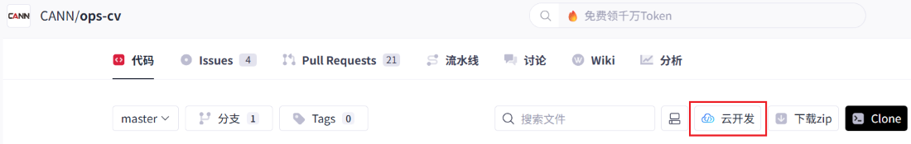

# 零基础入门：算子一站式开发平台

本指南旨在帮助您在 **算子一站式开发平台** 上快速上手算子仓的使用，包括环境安装、编译部署以及算子运行。

该平台为您提供了一套在线可直接运行的昇腾环境，环境中已安装必备的软件包，您无需手动安装，接下来请参考下述步骤快速体验起来吧！

## 一、环境准备

本阶段目的是启动云平台开发环境并检查运行环境是否正常，以便进行后续的算子编译、执行、开发等操作。

1. 进入ops-cv开源项目，单击`云开发 > WebIDE for Ascend`进入算子一站式开发平台，根据页面提示启动云开发环境。

   

2. 检查环境是否完备。

   打开云平台`终端`窗口，默认在`/mnt/workspace`目录下，执行如下命令验证环境和驱动是否正常。

  -   **检查NPU设备**：
    ```bash
    # 运行npu-smi，若返回驱动相关信息说明已成功挂载。
    npu-smi info
    ```
  -   **检查CANN安装**：
    ```bash
    # 查看CANN Toolkit版本信息，是否为对应的8.5.0版本
    cat /home/developer/Ascend/ascend-toolkit/latest/opp/version.info
    ```

## 二、编译部署

本阶段目的是**快速体验算子调用标准流程**，验证环境能否成功将算子源代码编译、打包、安装并运行。这里以仓库`examples`提供的**AddExample**算子作为实践对象。

### 1. 获取源码

```bash
# 获取源码，若已有请跳过（云平台已有）
git clone https://gitcode.com/cann/ops-cv.git
# 进入根目录
cd /mnt/workspace/ops-cv
```

### 2. 编译AddExample算子

进入项目根目录，编译指定的AddExample算子。
```bash
# 编译命令格式：bash build.sh --pkg --soc=<芯片版本> --ops=<算子名>
bash build.sh --pkg --soc=ascend910b --ops=add_example
```

若提示如下信息，说明编译成功。
```bash
Self-extractable archive "cann-ops-cv-custom-linux.${arch}.run" successfully created.
```
编译成功后，run包存放于项目根目录的build_out目录下。

### 3. 安装AddExample算子包
```bash
./build_out/cann-ops-cv-*linux*.run
```
`AddExample`安装在`${ASCEND_HOME_PATH}/opp/vendors`路径中，`${ASCEND_HOME_PATH}`表示CANN软件安装目录。

### 4. 配置环境变量

将自定义算子包的路径加入环境变量，确保运行时能够找到。

> 说明：\$\{ASCEND\_HOME\_PATH\}、\$\{LD\_LIBRARY\_PATH\}环境已配好无需手动传参。

```bash
export LD_LIBRARY_PATH=${ASCEND_HOME_PATH}/opp/vendors/custom_cv/op_api/lib:${LD_LIBRARY_PATH}
```

### 5.快速验证算子

`examples`目录下提供了简单的算子样例`add_example/examples/test_aclnn_add_example.cpp`，运行该样例验证算子功能是否正常。

```bash
# 运行命令格式：bash build.sh --run_example <算子名> <运行模式> <包模式>
bash build.sh --run_example add_example eager cust --vendor_name=custom
```
预期输出：打印AddExample算子加法计算结果，表明算子已成功部署并正确执行。
```
add_example result[0] is: 2.000000
add_example result[1] is: 2.000000
add_example result[2] is: 2.000000
add_example result[3] is: 2.000000
add_example result[4] is: 2.000000
add_example result[5] is: 2.000000
add_example result[6] is: 2.000000
add_example result[7] is: 2.000000
```

## 三、算子开发

本阶段目的是对已有的AddExample算子进行自定义修改，以修改核函数代码为例。

修改前提：按[编译部署](#二、编译部署)章节已成功调用AddExample算子。

功能变更：`AddExample`的计算逻辑从`z = x + y`为`z = x + y + y`。

### 1. 了解算子工程
`AddExample`算子的代码路径为`examples/add_example`，算子核心交付件为`Kernel（算子计算逻辑）`和`Tiling（算子切分策略）`，分别在`op_kernel`和`op_host`目录下：

``` text
add_example/
├── op_kernel/                   # 运行在NPU上
│   ├── add_example.cpp          # Kernel入口
│   └── add_example.h            # 核心计算逻辑实现文件（本次修改目标）
└── op_host/                     # 运行在CPU上
    └── add_example_tiling.cpp   # 数据切分策略
```

### 2. 修改Kernel逻辑
打开AddExample算子的核心Kernel实现文件[add_example.h](examples/add_example/op_kernel/add_example.h)，尝试在Compute函数中增加打印和Add指令，并保存修改。

```cpp
__aicore__ inline void AddExample<T>::Compute(int32_t progress)
{
    AscendC::LocalTensor<T> xLocal = inputQueueX.DeQue<T>();
    AscendC::LocalTensor<T> yLocal = inputQueueY.DeQue<T>();
    AscendC::LocalTensor<T> zLocal = outputQueueZ.AllocTensor<T>();
    AscendC::Add(zLocal, xLocal, yLocal, tileLength_);

    // ==== 修改点：添加打印和Add指令 ====
    AscendC::PRINTF("z = x + y + y\n");
    AscendC::Add(zLocal, zLocal, yLocal, tileLength_);

    outputQueueZ.EnQue<T>(zLocal);
    inputQueueX.FreeTensor(xLocal);
    inputQueueY.FreeTensor(yLocal);
}
```
### 3. 重新编译验证

重复[编译部署](#二、编译部署)章节中的第2至第5步：
1. **重新编译**：`bash build.sh --pkg --soc=ascend910b --ops=add_example`
2. **重新安装**：`./build_out/cann-ops-cv-*linux*.run`
3. **重新验证**：`bash build.sh --run_example add_example eager cust --vendor_name=custom`
4. **成功标志**：重新运行后，打印的计算结果从`2.000000`变为`3.000000`
```
add_example result[0] is: 3.000000
add_example result[1] is: 3.000000
add_example result[2] is: 3.000000
add_example result[3] is: 3.000000
add_example result[4] is: 3.000000
add_example result[5] is: 3.000000
add_example result[6] is: 3.000000
add_example result[7] is: 3.000000
```

## 四、算子调试与性能采集

本阶段目的是对已有的AddExample算子进行简单的调试打印和性能采集，以便进行后续算子问题定位和性能优化。

### 1. 调试打印
算子如果出现执行失败、精度异常等问题，可通过打印进行问题分析和定位。

以`AddExample`算子为例，在`examples/add_example/op_kernel/add_example.h`中进行代码修改和调试。

* **printf**

  该接口支持打印Scalar类型数据，如整数、字符型、布尔型等，详细介绍请参见[《Ascend C API》](https://hiascend.com/document/redirect/CannCommunityAscendCApi)中“算子调测API > printf”。

  ```c++
  blockLength_ = (tilingData->totalLength + AscendC::GetBlockNum() - 1) / AscendC::GetBlockNum();
  tileNum_ = tilingData->tileNum;
  tileLength_ = ((blockLength_ + tileNum_ - 1) / tileNum_ / BUFFER_NUM) ?
        ((blockLength_ + tileNum_ - 1) / tileNum_ / BUFFER_NUM) : 1;
  // 打印当前核计算Block长度
  AscendC::PRINTF("Tiling blockLength is %llu\n", blockLength_);
  ```
* **DumpTensor**

  该接口支持Dump指定Tensor的内容，同时支持打印自定义附加信息，比如当前行号等，详细介绍请参见[《Ascend C API》](https://hiascend.com/document/redirect/CannCommunityAscendCApi)中“算子调测API > DumpTensor”。

  ```c++
  AscendC::LocalTensor<T> zLocal = outputQueueZ.DeQue<T>();
  // 打印zLocal Tensor信息
  DumpTensor(zLocal, 0, 128);
  ```
### 2. 性能采集

当算子功能验证正确后，可通过`msprof`工具采集算子性能数据，以便进一步分析和改进算子性能优化点。

-  **生成可执行文件**：
   调用`example`目录下AddExample算子样例，生成可执行文件（test_aclnn_add_example），该文件位于本项目`ops-cv/build`目录。

    ```
    bash build.sh --run_example add_example eager cust --vendor_name=custom
    ```

- **采集性能数据**：

  进入`AddExample`算子可执行文件目录`ops-cv/build/`，执行如下命令：

    ```bash
    msprof --application="./test_aclnn_add_example"
    ```

  采集结果在本项目`ops-cv/build/`目录，msprof命令执行完成后，会自动解析并导出性能数据结果文件，结果信息介绍请参见[msprof](https://www.hiascend.com/document/detail/zh/mindstudio/82RC1/T&ITools/Profiling/atlasprofiling_16_0110.html#ZH-CN_TOPIC_0000002504160251)。

## 五、算子验证

本阶段目的是学习拓展，为了确保算子的通用性，可以学习如何构建不同的测试用例并对算子进行功能验证。

例如通过修改`example`目录下AddExample算子的输入数据，验证该算子在多种场景下的功能正确性。

### 1. 修改测试代码
找到并编辑`AddExample`样例对应的test_aclnn_add_example.cpp，修改输入张量的形状和数值。

```c++
int main() {
    // ... 初始化代码 ...
  
    // 修改前：shape = {32, 4, 4, 4}, 数值全为1
    // 修改后：将输入shape改为 {8, 8, 8, 8}，并填充不同的测试数据
    std::vector<int64_t> selfXShape = {8, 8, 8, 8};
    std::vector<float> selfXHostData(4096); // 4096 = 8 * 8 * 8 *8
    // 可使用循环填充更有区分度的数据，例如递增序列
    for (int i = 0; i < 4096; ++i) {
        selfXHostData[i] = static_cast<float>(i % 10); // 填充0-9的循环值
    }
    // 同理修改selfY的输入...
      
    // ... 后续执行代码 ...
}
```

### 2. 重新验证

1. 由于只修改了example测试代码，无需重新编译算子包。

2. 重新执行验证命令：`bash build.sh --run_example add_example eager cust --vendor_name=custom`

3. 观察算子执行后的输出结果是否符合预期。

## 六、总结与进阶

通过体验上述环境准备、算子调用、算子开发等过程，您完成了一个新算子，可以将新算子贡献到本项目`experimental`目录，详细贡献流程请参考[贡献指南](CONTRIBUTING.md)。过程中，如您遇到问题可通过Issue方式咨询。

如果您想要**深入了解各种场景**下如何调用、开发算子等，请您参考以下详细指南：

- [环境部署](./docs/zh/context/quick_install.md)：提供不同场景下的环境搭建方案，包括Docker安装、手动安装CANN软件包等。
- [编译部署及算子调用](./docs/zh/invocation/quick_op_invocation.md)：提供不同场景（如离线编译）、不同方式的算子包编译和验证方案，可深入了解编译参数与调用方式。
- [算子开发](./docs/zh/develop/aicore_develop_guide.md)：提供算子端到端完整开发指南，包括从零创建算子工程、实现Tiling和Kernel等。
- [调试调优](./docs/zh/debug/op_debug_prof.md)：提供更系统的调试技巧与性能优化方法。
