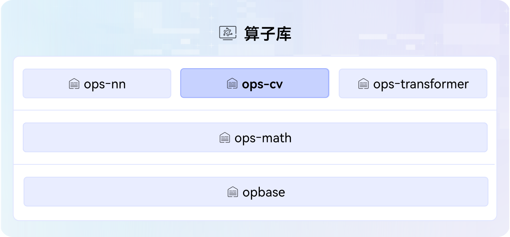

# ops-cv

## 🔥Latest News

- [2025/09] ops-cv项目首次上线。

## 🚀概述

ops-cv是[CANN](https://hiascend.com/software/cann) （Compute Architecture for Neural Networks）算子库中提供图像处理、目标检测等能力的高阶算子库，涵盖常见的图像处理操作，包括image类、objdetect类算子，算子库架构图如下：



## ⚡️快速入门

若您希望快速体验算子的调用和开发过程，请访问如下文档获取简易教程。

- [算子列表](docs/op_list.md)：介绍项目提供的全量算子信息，方便快速查询。
- [环境部署](docs/context/quick_install.md)：介绍项目基础环境的搭建，包括软件包和第三方依赖的获取和安装。
- [算子调用](docs/invocation/quick_op_invocation.md)：介绍调用算子的基本步骤，快速搭建环境，实现算子编译执行。
- [算子开发](docs/develop/aicore_develop_guide.md)：介绍开发算子的基本流程，一键创建算子工程目录，实现Tiling、Kernel核心交付件。

## 📖学习教程

若您希望深入体验项目功能并修改算子源码，请访问如下文档获取详细教程。
- [算子调用方式](docs/zh/invocation/op_invocation.md)：介绍不同的调用算子方式，方便快速应用于不同的AI业务场景。
- [算子调试调优](docs/zh/debug/op_debug_prof.md)：介绍常见的算子调试和调优方法，如DumpTensor、msProf等。
- [算子基本概念](docs/zh/context/基本概念.md)：介绍算子领域相关术语和概念，如非连续Tensor、量化模式等。

## 🔍目录结构
关键目录如下，详细目录介绍参见[项目目录](./docs/zh/context/dir_structure.md)。
```
├── build.sh                       # 项目工程编译脚本
├── cmake                          # 项目工程编译目录
├── CMakeLists.txt
├── common                         # 项目公共头文件和公共源码                 
├── docs                           # 项目文档介绍(zh为中文，en为英文) 
├── examples                       # 端到端算子开发和调用示例
├── experimental                   # 用户自定义算子存放目录
├── objdetect                      # objdetect类算子
├── ...
├── image                          # image类算子
│   ├── grid_sample                # GridSample算子所有交付件，如Kernel、InferShape等
│   │   ├── CMakeLists.txt         # 算子编译配置文件
│   │   ├── docs                   # 算子说明文档
│   │   ├── examples               # 算子使用示例
│   │   ├── op_graph               # 算子构图相关目录
│   │   ├── op_host                # 算子信息库、Tiling、InferShape相关实现目录
│   │   │   └── op_api             # 可选，算子aclnn接口实现目录，如未提供则表示此算子的aclnn接口会让工程自动生成
│   │   ├── op_kernel              # 算子Kernel目录
│   │   └── README.md              # 算子介绍文档
│   ├── ...
│   └── CMakeLists.txt             # 算子编译配置文件
├── tests                          # 测试工程目录
├── README.md
├── install_deps.sh                # 安装依赖包脚本
├── requirements.txt               # 项目需要的第三方依赖包
└── scripts                        # 脚本目录，包含自定义算子、Kernel构建相关配置文件
```

## 📝相关信息

- [贡献指南](CONTRIBUTING.md)
- [安全声明](SECURITY.md)
- [许可证](LICENSE)
