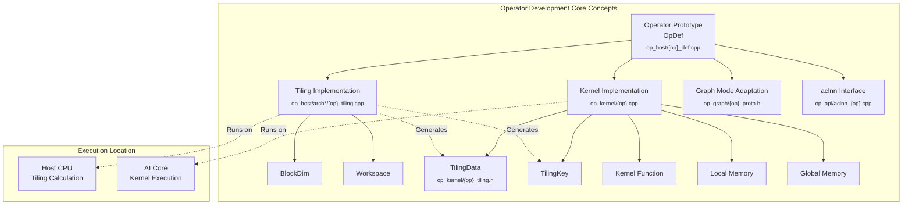
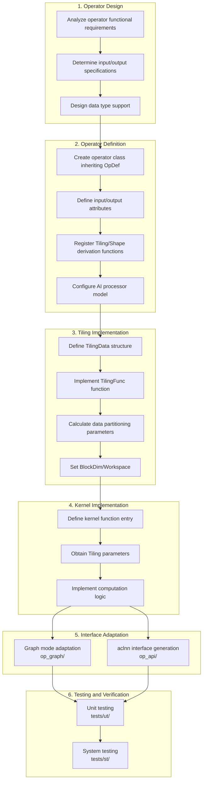
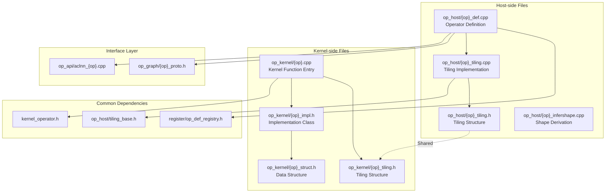
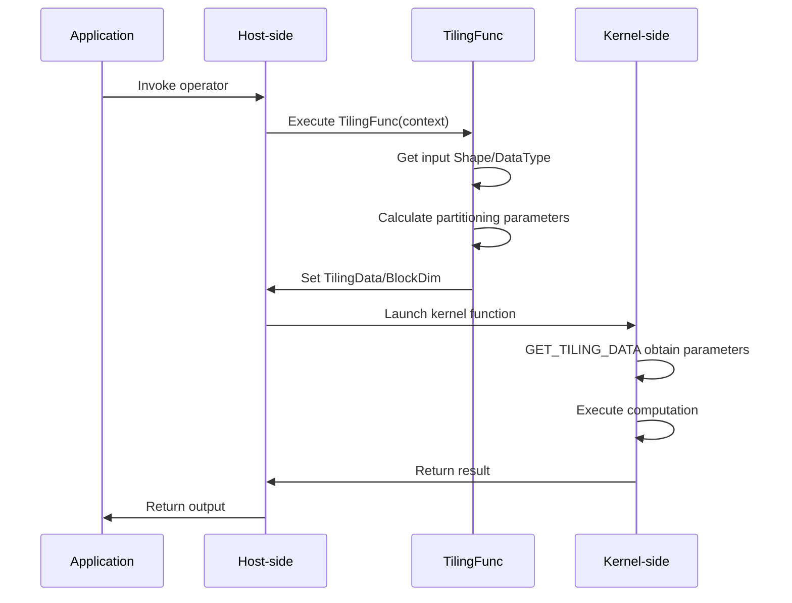
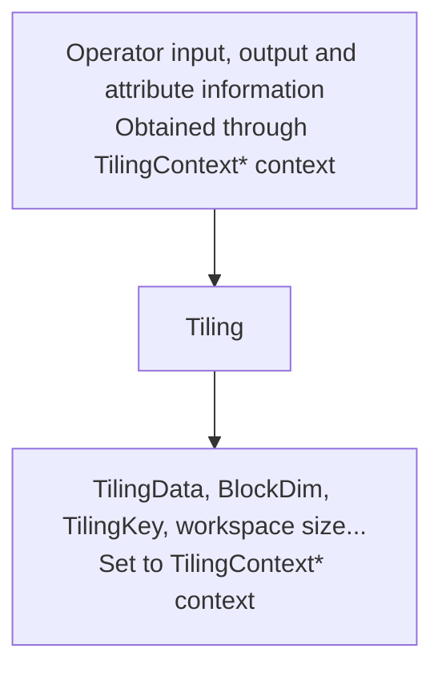
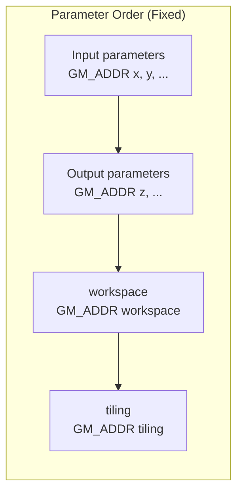
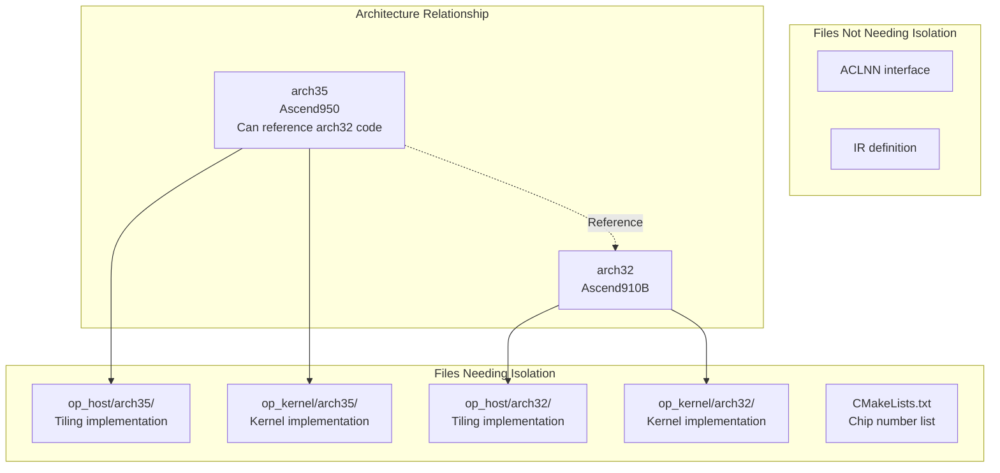

# AI Core Operator Development Advanced Guide

> This document is a detailed content supplement to the "AI Core Operator Development Guide", providing in-depth explanations and advanced usage of each module in operator development. It is recommended to read the [main document](./aicore_develop_guide.md) first to understand the overall development process.

## Table of Contents

- [Core Concepts](#core-concepts)
- [Operator Development Process](#operator-development-process)
- [File Structure and Dependencies](#file-structure-and-dependencies)
- [Operator Definition](#operator-definition)
  - [Operator Input/Output/Attribute Definition](#operator-inputoutputattribute-definition)
  - [Implementation Information on AI Processor](#implementation-information-on-ai-processor)
  - [Register Tiling Implementation, Shape Derivation Functions](#register-tiling-implementation-shape-derivation-functions)
  - [Register Differentiated Operator Prototypes for Multiple Hardware Platforms](#register-differentiated-operator-prototypes-for-multiple-hardware-platforms)
- [Tiling Implementation](#tiling-implementation)
  - [Basic Process](#basic-process)
  - [Define Tiling Structure Using Standard C++ Syntax](#define-tiling-structure-using-standard-c-syntax)
  - [Tiling Template Programming](#tiling-template-programming)
- [Kernel Implementation](#kernel-implementation)
  - [Kernel Function Definition](#kernel-function-definition)
  - [GET_TILING_DATA Obtain Tiling Parameters](#get_tiling_data-obtain-tiling-parameters)
  - [Derive Input Data Type and Format Inside Kernel Function](#derive-input-data-type-and-format-inside-kernel-function)
- [Graph Mode Adaptation](#graph-mode-adaptation)
- [aclnn Adaptation](#aclnn-adaptation)
- [Generation Isolation](#generation-isolation)
- [Common Issues](#common-issues)
- [Constraint Summary](#constraint-summary)
- [API Quick Reference](#api-quick-reference)

---

## Core Concepts

### Concept Relationship Diagram



### Key Terminology Table

| Term | English | Description | Deliverable File | Related Section |
|------|---------|-------------|------------------|-----------------|
| **Operator Prototype** | OpDef | Operator input/output attribute definition | `op_host/{op}_def.cpp` | [Operator Definition](#operator-definition) |
| **Tiling** | Tiling | Process of data partitioning and block computation | `op_host/arch*/{op}_tiling.cpp` | [Tiling Implementation](#tiling-implementation) |
| **TilingData** | Tiling Data | Data structure for partitioning algorithm parameters | `op_kernel/{op}_tiling.h` | [Tiling Structure](#define-tiling-structure-using-standard-c-syntax) |
| **BlockDim** | Block Dimension | Number of cores for kernel function execution | `op_host/arch*/{op}_tiling.cpp` | [Basic Process](#basic-process) |
| **TilingKey** | Tiling Key | Identifier for distinguishing different kernel implementation branches | `op_host/arch*/{op}_tiling.cpp` | [Tiling Template Programming](#tiling-template-programming) |
| **Workspace** | Workspace | Working memory on device-side Global Memory | `op_host/arch*/{op}_tiling.cpp` | [Basic Process](#basic-process) |
| **Kernel Function** | Kernel Function | Function executed on AI Core | `op_kernel/{op}.cpp` | [Kernel Function Definition](#kernel-function-definition) |
| **IR Definition** | IR Definition | Graph mode operator prototype definition | `op_graph/{op}_proto.h` | [Graph Mode Adaptation](#graph-mode-adaptation) |
| **aclnn** | ACL Neural Network | Single operator invocation interface | `op_api/aclnn_{op}.cpp` | [aclnn Adaptation](#aclnn-adaptation) |
| **Generation Isolation** | Generation Isolation | Code isolation for different chip architectures | `arch32/` `arch35/` | [Generation Isolation](#generation-isolation) |

---

## Operator Development Process

### Overall Development Flowchart



### Development Steps Details

| Step | Main Files | Key APIs | Output Artifacts |
|------|------------|----------|------------------|
| 1. Operator Design | - | - | Operator specification document |
| 2. Operator Definition | `op_host/{op}_def.cpp` | `OpDef`, `Input()`, `Output()`, `OP_ADD()` | Operator prototype registration |
| 3. Tiling Implementation | `op_host/{op}_tiling.cpp` | `TilingFunc`, `GetTilingData<>()`, `SetBlockDim()` | Tiling parameters |
| 4. Kernel Implementation | `op_kernel/{op}.cpp` | `__global__ __aicore__`, `GET_TILING_DATA` | Kernel function binary |
| 5. Graph Mode Adaptation | `op_graph/{op}_proto.h` | `REG_OP()`, `INPUT()`, `OUTPUT()` | IR definition |
| 6. aclnn Adaptation | `CMakeLists.txt` | `ACLNNTYPE aclnn` | API dynamic library |

---

## File Structure and Dependencies

### Operator Project Directory Structure

```text
{op_name}/                      # Operator root directory (such as add/)
├── CMakeLists.txt              # Build configuration (required)
├── README.md                   # Operator description
│
├── op_host/                    # Host-side implementation (required)
│   ├── {op}_def.cpp           # Operator definition (required)
│   ├── {op}_infershape.cpp    # Shape derivation
│   ├── arch32/                 # Ascend910B architecture
│   │   ├── {op}_tiling.cpp    # Tiling implementation
│   │   └── {op}_tiling.h
│   ├── arch35/                 # Ascend950 architecture
│   │   ├── {op}_tiling.cpp
│   │   └── {op}_tiling.h
│   └── config/                 # Chip configuration
│       └── ascend950/
│
├── op_kernel/                  # Kernel-side implementation (required)
│   ├── {op}.cpp               # Kernel entry (arch32)
│   ├── {op}_apt.cpp           # Kernel entry (arch35)
│   ├── arch32/                 # Ascend910B implementation
│   │   ├── {op}_impl.h
│   │   └── {op}_struct.h
│   └── arch35/                 # Ascend950 implementation
│       ├── {op}_apt_impl.h
│       └── {op}_struct.h
│
├── op_graph/                   # Graph mode adaptation
│   ├── {op}_proto.h           # Operator prototype
│   └── {op}_graph_infer.cpp   # Type derivation
│
├── op_api/                     # API implementation
│   ├── aclnn_{op}.cpp         # aclnn implementation
│   ├── aclnn_{op}.h           # aclnn header file
│   └── {op}.cpp               # Operator implementation
│
├── docs/                       # Operator documentation
│   └── aclnn{Op}.md
│
├── examples/                   # Invocation samples
│   └── test_aclnn_{op}.cpp
│
└── tests/                      # Test code
    ├── ut/                     # Unit tests
    └── st/                     # System tests
```

### File Dependency Diagram



### Host and Kernel Data Interaction



---

## Operator Definition

The operator prototype mainly describes the operator's input/output, attributes and other information, as well as the implementation information on the AI processor, and associates tiling implementation and other functions. The operator prototype is carried by a custom operator class, which inherits from the OpDef class. After completing the operator prototype definition and other operations, you need to call the OP_ADD interface, passing in the operator type (the class name of the custom operator class), to register the operator prototype. Below is a simple example of Add operator prototype definition and registration.

```c++
namespace ops {
class AddCustom : public OpDef {
public:
    AddCustom(const char* name) : OpDef(name)
    {
        this->Input("x")
            .ParamType(REQUIRED)
            .DataType({ge::DT_FLOAT16, ge::DT_FLOAT, ge::DT_INT32})
            .Format({ge::FORMAT_ND, ge::FORMAT_ND, ge::FORMAT_ND});
        this->Input("y")
            .ParamType(REQUIRED)
            .DataType({ge::DT_FLOAT16, ge::DT_FLOAT, ge::DT_INT32})
            .Format({ge::FORMAT_ND, ge::FORMAT_ND, ge::FORMAT_ND});
        this->Output("z")
            .ParamType(REQUIRED)
            .DataType({ge::DT_FLOAT16, ge::DT_FLOAT, ge::DT_INT32})
            .Format({ge::FORMAT_ND, ge::FORMAT_ND, ge::FORMAT_ND});
        // The following shape/datatype derivation functions are only used in operator graph scenarios
        this->SetInferShape(ge::InferShape);
        this->SetInferDataType(ge::InferDataType);
        this->AICore()
            .SetTiling(optiling::TilingFunc);
        // Please replace with the actual Ascend AI processor model
        this->AICore().AddConfig("ascendxxx");
    }
};
OP_ADD(AddCustom);
} // namespace ops
```

> Note
>
> - Based on the operator prototype definition, the custom operator project can achieve the following automation capabilities:
>   - Automatically generate the implementation and interface for single operator API invocation, developers can directly use the generated API for single operator invocation.
>   - Automatically generate the [operator prototype definition REG_OP](###GE Graph Mode Prototype Definition) used in graph mode scenarios, developers can use the generated operator prototype for graph construction, graph compilation, graph execution and other operations.
> - After registering the operator type, the framework will obtain the operator registration information based on the operator type, and match the operator implementation file name and kernel-side kernel function name according to certain rules during compilation and runtime. To ensure correct matching, the operator type, operator implementation file name and kernel function name need to follow the following definition rules. Normally, developers only need to ensure that the operator type op parameter value in the prototype definition json file is in PascalCase naming convention when creating the operator project, and the automatically generated code after project creation will meet this rule. When manually writing operator prototype definition and operator implementation files, you need to define according to the following rules.
>   - The operator type needs to use **PascalCase** naming convention, that is, use uppercase characters to distinguish different semantics.
>   - The operator implementation file name and kernel function name need to be the same, both are the value after converting the operator type to **snake_case** naming convention. The following describes the process of converting operator type to operator implementation file name and kernel function name:
>     - Convert the first uppercase character to lowercase character. For example: Abc -> abc.
>     - If the previous character of an uppercase character is a lowercase character or digit, insert an underscore "_" before the uppercase character and convert the character to lowercase. For example: AbcDef -> abc_def.
>     - If the previous character of an uppercase character is uppercase and the next character is lowercase, insert an underscore "_" before the uppercase character and convert the character to lowercase. For example: AbcAAc -> abc_a_ac.
>     - Convert other uppercase characters to lowercase characters, lowercase characters remain unchanged.

### Operator Naming Rule Examples

```text
Operator Type (PascalCase)  →  Implementation File Name/Kernel Function Name (snake_case)
─────────────────────────────────────────────────────────────────────────────────
AddCustom           →  add_custom
BatchNorm           →  batch_norm
Conv2DBackprop      →  conv2d_backprop
ReduceMax           →  reduce_max
StatelessRandom    →  stateless_random
```

### Operator Input/Output/Attribute Definition

The operator prototype definition describes the operator's input/output, attributes and other information. The number of supported datatype and format for input and output needs to be consistent and maintain a one-to-one correspondence.

> **Important Note: Operator prototype registration requires permutation, IR definition only needs enumeration**
>
> When an operator has multiple inputs and outputs, **operator prototype registration** needs to clearly indicate the data type correspondence between inputs and outputs (permutation), while **IR definition** only needs to enumerate the supported data types for each.
>
> For example: An operator input x supports float32/float16, output y supports float32/float16, but the correspondence is:
>
> - float32 → float32
> - float16 → float16
> - float16 → float32
>
> | Definition Location | Writing Style | Description |
> |----------|------|------|
> | **Operator Prototype Registration** | Need to list by **correspondence permutation** | The 1st type of x corresponds to the 1st type of y, and so on |
> | **IR Definition** | Only need to **enumerate** supported types for each input/output | No need to indicate input/output correspondence |
>
> ```c++
> // Operator prototype registration (op_host/{op}_def.cpp) - requires permutation
> this->Input("x")
>     .DataType({ge::DT_FLOAT, ge::DT_FLOAT16, ge::DT_FLOAT16})  // 1st, 2nd, 3rd correspond to output's 1st, 2nd, 3rd
>     .Format({ge::FORMAT_ND, ge::FORMAT_ND, ge::FORMAT_ND});
> this->Output("y")
>     .DataType({ge::DT_FLOAT, ge::DT_FLOAT16, ge::DT_FLOAT})    // float32->float32, float16->float16, float16->float32
>     .Format({ge::FORMAT_ND, ge::FORMAT_ND, ge::FORMAT_ND});
>
> // IR definition (op_graph/{op}_proto.h) - only needs enumeration
> .INPUT(x, TensorType({DT_FLOAT, DT_FLOAT16}))
> .OUTPUT(y, TensorType({DT_FLOAT, DT_FLOAT16}))
> ```

The following code snippet presents the description information of Add operator input x.

```c++
this->Input("x")
    .ParamType(REQUIRED)
    .DataType({ge::DT_FLOAT16, ge::DT_FLOAT, ge::DT_INT32})
    .Format({ge::FORMAT_ND, ge::FORMAT_ND, ge::FORMAT_ND});
```

**Table 1 Input/Output Parameter Description**

| Prototype Definition | Parameter | Description |
| ------------ | --------- | ------------------------------------------------------------ |
| Input/Output | ParamType | Parameter type, Option values are: OPTIONAL (optional), REQUIRED (required), DYNAMIC (dynamic input). Similar to the Add sample above, its input and output are required. Some operators have dynamic input or output counts, for example AddN sums N input Tensors into one output Tensor; SplitV splits one Tensor into N Tensors on a certain axis. Some operators have optional inputs/outputs, for example BatchNorm operator has no mean and variance input during training, but has mean and variance input during inference. |
|              | DataType  | Datatype supported by operator input/output. |
|              | Format    | Format supported by operator input/output. |

From the prototype definition above, it can be seen that all datatype and format combinations for input and output are listed, maintaining one-to-one correspondence. Using the following interfaces can simplify this code logic.

- When specifying input/output datatype information, if a certain input/output's datatype supports combination with all other inputs/outputs' datatype/format, its datatype can be expressed through DataTypeList; when specifying input/output format information, if a certain input/output's format supports combination with all other inputs/outputs' datatype/format, its format can be expressed through FormatList. The example is as follows, the following two code expressions have the same meaning.

```c++
// List all one-to-one combinations
class XxxCustom : public OpDef {
public:
    XxxCustom(const char* name) : OpDef(name)
    {
        this->Input("x")
            .ParamType(REQUIRED)
            .DataType({ge::DT_FLOAT16, ge::DT_FLOAT16, ge::DT_FLOAT16})
            .Format({ge::FORMAT_ND, ge::FORMAT_ND, ge::FORMAT_ND});
        this->Input("y")
            .ParamType(REQUIRED)
            .DataType({ge::DT_FLOAT16, ge::DT_FLOAT, ge::DT_INT32})
            .Format({ge::FORMAT_ND, ge::FORMAT_ND, ge::FORMAT_ND});
        this->Output("z")
            .ParamType(REQUIRED)
            .DataType({ge::DT_FLOAT16, ge::DT_FLOAT, ge::DT_INT32})
            .Format({ge::FORMAT_ND, ge::FORMAT_ND, ge::FORMAT_ND});
        ...
    }
};
// Express through DataTypeList and FormatList, no need to list repeatedly
class XxxCustom : public OpDef {
public:
    XxxCustom(const char* name) : OpDef(name)
    {
        this->Input("x")
            .ParamType(REQUIRED)
            .DataTypeList({ge::DT_FLOAT16})
            .FormatList({ge::FORMAT_ND});
        this->Input("y")
            .ParamType(REQUIRED)
            .DataType({ge::DT_FLOAT16, ge::DT_FLOAT, ge::DT_INT32})
            .Format({ge::FORMAT_ND, ge::FORMAT_ND, ge::FORMAT_ND});
        this->Output("z")
            .ParamType(REQUIRED)
            .DataType({ge::DT_FLOAT16, ge::DT_FLOAT, ge::DT_INT32})
            .Format({ge::FORMAT_ND, ge::FORMAT_ND, ge::FORMAT_ND});
        ...
    }
};

```

- Use the Follow interface to specify that the current input/output's datatype/format/shape information is consistent with a previously defined input. The example is as follows: output "y1" follows input "x1" scenario, at this time "y1"'s datatype, format and shape will all be consistent with "x1". When using the Follow interface to specify consistent shape, the logic is usually simpler than the shape derivation function. For logic that can be expressed with Follow, it is recommended to use the Follow interface, then there is no need to write and register the InferShape function.

```c++
this->Input("x1")
    .ParamType(REQUIRED)
    .DataType({ge::DT_FLOAT, ge::DT_FLOAT})
    .Format({ge::FORMAT_ND, ge::FORMAT_ND});
this->Input("x2")
    .ParamType(REQUIRED)
    .DataType({ge::DT_FLOAT, ge::DT_FLOAT})
    .Format({ge::FORMAT_ND, ge::FORMAT_ND});
this->Output("y1")
    .ParamType(REQUIRED)
    .Follow("x1")
    .OutputShapeDependOnCompute();
```

The prototype definition also includes operator attribute information. The following code snippet presents the description information of ReduceMax operator's attributes reduceDim and isKeepDim.

```c++
this->Attr("reduceDim")
    .AttrType(REQUIRED)
    .Int();
this->Attr("isKeepDim")
    .AttrType(OPTIONAL)
    .Int(1);
```

**Specific parameter descriptions are as follows:**

| Prototype Definition | Registration Method | Description |
| -------- | ----------------- | ------------------------------------------------------------ |
| Attr     | AttrType          | Set operator attribute type, values are: OPTIONAL (optional), REQUIRED (required). |
|          | Bool/Float/Int... | Set operator attribute data type to Bool/Float/Int... |

### Implementation Information on AI Processor

Register the AI processor models supported by the operator and related configuration information through AddConfig. The AddConfig interface prototype is as follows: the soc parameter represents the AI processor model, and aicore_config represents other configuration information.

```c++
void AddConfig(const char *soc);
void AddConfig(const char *soc, OpAICoreConfig &aicore_config);
```

The sample for registering AI processor model through this interface is as follows. For the ascendxxx filling rule, please refer to the ASCEND_COMPUTE_UNIT field in the CMakePresets.json file in the operator project directory.

```c++
this->AICore().AddConfig("ascend910b");
```

For other AI Core configuration information, please refer to OpAICoreConfig.

### Register Tiling Implementation, Shape Derivation Functions

Register corresponding Tiling implementation and Shape derivation functions through SetInferShape, SetInferDataType, SetTiling interfaces. The sample is as follows. The registered Tiling implementation and other functions are called by the framework side, and the corresponding Context context is passed in during the call for developers to use. For Tiling function implementation method, please refer to Host-side Tiling implementation. For graph-related Shape derivation function implementation, please refer to Operator Graph (GE Graph) development.

```c++
// The following shape/datatype derivation functions are only used in operator graph scenarios
this->SetInferShape(ge::InferShape);
this->SetInferDataType(ge::InferDataType);
this->AICore()
    .SetTiling(optiling::TilingFunc);
```

### Register Differentiated Operator Prototypes for Multiple Hardware Platforms

The operator class inherits the base class OpDef and uses Input, Output, Attr to register operator prototype information. When hardware platforms support the same operator prototype, you can directly add supported AI processor models through AICore().AddConfig. When different hardware forms have different operator prototype definitions, you can register differentiated operator prototypes for different AI processor models by adding OpAICoreConfig.

**Differentiated Operator Prototype Effective Rules:**

For OpAICoreConfig configuration information:

- For operator class input/output prototype information, OpAICoreConfig undefined parts will inherit OpDef defined prototypes. For example, if output y is defined in the operator class but not in OpAICoreConfig, OpAICoreConfig will inherit y's prototype definition.
- For cases where the operator prototype defined in the operator class and the newly added OpAICoreConfig are the same, the operator prototype information defined in the newly added OpAICoreConfig will override the prototype information defined in OpDef. For example, if input x supports DT_FLOAT16 data type in the operator class, and input x is also defined in the newly added OpAICoreConfig but supports DT_FLOAT16 and DT_BF16 data types, the newly added definition in OpAICoreConfig will prevail.

In the following sample, ascendxxx1 and ascendxxx2 (AI processor models) use the same operator prototype. The operator class inherits the base class OpDef and uses Input, Output, Attr to register operator prototype information, then adds supported AI processor models through AICore().AddConfig. For ascendxxx3 supported operator prototype that needs customized processing, DT_BF16 type is added, registered through the newly added OpAICoreConfig. The definitions of x, y, z will override the corresponding prototype information defined in the operator class.

```c++
namespace ops {
class MyAdd : public OpDef {
public:
    MyAdd(const char* name) : OpDef(name)
    {
        // ascendxxx1 ascendxxx2 AI processor model prototype definition
        this->Input("x")
            .ParamType(REQUIRED)
            .DataType({ge::DT_FLOAT16})
            .Format({ge::FORMAT_ND});
        this->Input("y")
            .ParamType(OPTIONAL)
            .DataType({ge::DT_INT64})
            .Format({ge::FORMAT_ND});
        this->Output("z")
            .ParamType(REQUIRED)
            .DataType({ge::DT_FLOAT16})
            .Format({ge::FORMAT_ND});
        this->AICore()
            .SetTiling(optiling::TilingFunc);
        this->AICore().AddConfig("ascendxxx1");
        this->AICore().AddConfig("ascendxxx2");
        // ascendxxx3 AI processor defines OpAICoreConfig variable, customized prototype
        OpAICoreConfig config;
        config.Input("x")
            .ParamType(REQUIRED)
            .DataType({ge::DT_FLOAT16, ge::DT_BF16})
            .Format({ge::FORMAT_ND, ge::FORMAT_ND});
        config.Input("y")
            .ParamType(REQUIRED)
            .DataType({ge::DT_FLOAT16, ge::DT_BF16})
            .Format({ge::FORMAT_ND, ge::FORMAT_ND});
        config.Output("z")
            .ParamType(REQUIRED)
            .DataType({ge::DT_FLOAT16, ge::DT_BF16})
            .Format({ge::FORMAT_ND, ge::FORMAT_ND});
        this->AICore().AddConfig("ascendxxx3", config);
    }
};
OP_ADD(MyAdd);
}
```

In the following sample, only a few parameter prototype information is inconsistent across different hardware platforms. Developers can also customize partial operator prototype information through OpAICoreConfig, reusing other operator prototype information defined in OpDef, achieving the purpose of partial prototype information hardware platform customization.

```c++
class AddCustom : public OpDef {
public:
    AddCustom(const char* name) : OpDef(name)
    {
        this->Input("x").DataType({ ge::DT_FLOAT16 }).ParamType(OPTIONAL);
        this->Output("y").DataType({ ge::DT_FLOAT16 });
        OpAICoreConfig aicConfig1;
        OpAICoreConfig aicConfig2;
        aicConfig1.Input("x")
            .ParamType(OPTIONAL)
            .DataType({ ge::DT_FLOAT })
            .Format({ ge::FORMAT_ND });
        aicConfig2.Input("x")
            .ParamType(REQUIRED)
            .DataType({ ge::DT_INT32 })
            .Format({ ge::FORMAT_ND });
        this->AICore().AddConfig("ascendxxx1", aicConfig1);
        this->AICore().AddConfig("ascendxxx2", aicConfig2);
    }
};
```

---

## Tiling Implementation

### Basic Process

This section focuses on the programming mode and API usage when integrating with the CANN framework.

In most cases, Local Memory storage cannot completely accommodate the operator's input and output. It is necessary to move a portion of input for calculation and then move out, then move the next portion of input for calculation until the complete final result is obtained. This process of data partitioning and block computation is called **Tiling**. The calculation program that determines data partitioning algorithm related parameters (such as the block size moved each time and the total number of loops) based on operator shape and other information is called **Tiling Implementation**.

After the Tiling implementation is completed, the obtained Tiling partitioning algorithm related parameters will be passed to the kernel side to guide parallel data partitioning. Since the Tiling implementation only performs scalar calculations, which AI Core is not good at, we separate it and execute it on the host CPU.

**Figure 1** Tiling Implementation Input and Output



As shown in the figure above, Tiling implementation is the process of determining partitioning algorithm related parameters based on operator shape and other information. Here, operator shape and other information can be understood as **Tiling implementation input**, and partitioning algorithm related parameters can be understood as **Tiling implementation output**. Both input and output are carried through the Tiling function parameter (TilingContext* context structure). That is, developers can obtain the operator's input, output and attribute information from the context structure, which is **Tiling implementation input**. After Tiling calculation, obtain TilingData data structure (partitioning algorithm related parameters), blockDim variable, TilingKey for selecting different kernel implementation branches, operator workspace size, which is **Tiling implementation output**, and set these outputs to the context structure.

### Tiling Output Parameter Details

| Parameter | Type | Description | Setting Method |
|------|------|------|----------|
| **TilingData** | struct | Partitioning algorithm related parameters, such as block size moved each time, loop count | `context->GetTilingData<T>()` |
| **blockDim** | uint32_t | Number of cores for kernel function execution, range [1,65535] | `context->SetBlockDim(n)` |
| **TilingKey** | uint64_t | Identifier for distinguishing different kernel implementation branches | `context->SetTilingKey(key)` |
| **WorkspaceSize** | size_t | Working memory size on Global Memory | `context->GetWorkspaceSizes(n)` |

### BlockDim Setting Rules

> blockDim is a logical core concept, with a value range of [1,65535]. To fully utilize hardware resources, it is generally set to the number of physical cores or a multiple thereof.

**blockDim settings for different modes:**

| Mode | Description | Suggested Value |
|------|------|--------|
| **Coupled Mode** | Vector and Cube units integrated together, no type distinction | `GetCoreNumAiv()` or `GetCoreNumAic()` |
| **Separated Mode - Vector Operator** | Vector computation only | Vector core count, such as 40 |
| **Separated Mode - Cube Operator** | Cube computation only | Cube core count, such as 20 |
| **Separated Mode - Fused Operator** | Vector/Cube fusion, launched by combination | Combination count (not exceeding physical combination core count) |

### Workspace Setting

Workspace is a block of memory on device-side Global Memory, divided into two parts:

1. **Ascend C API reserved memory**: Obtained through `GetLibApiWorkSpaceSize`
2. **Operator implementation used memory**: Allocated according to operator requirements

```c++
auto workspaceSizes = context->GetWorkspaceSizes(1); // Only use 1 workspace block
workspaceSizes[0] = sysWorkspaceSize + usrWorkspaceSize;
```

### Define Tiling Structure Using Standard C++ Syntax

#### Specific Steps

When defining Tiling structure, you can use standard C++ syntax to define a **POD type (Plain Old Data)**, that is, a data type compatible with C language. The specific steps are as follows.

- Use C++ syntax to define Tiling structure.

  The header file where this structure is defined should be placed in the op_kernel directory of the operator project. Since only files in this directory will be packaged into the operator package for use in online compilation scenarios, placing files in other directories may cause online compilation to fail due to missing files.

  When users use high-level API Tiling structure, they reference predefined Tiling structures in "kernel_tiling/kernel_tiling.h" through AscendC::tiling namespace, as shown in the following code.

  ```c++
  #ifndef MATMUL_CUSTOM_TILING_H
  #define MATMUL_CUSTOM_TILING_H
  #include <cstdint>
  #include "kernel_tiling/kernel_tiling.h"    // for TCubeTiling

  struct MatmulCustomTilingData {
      uint64_t localMemSize;
      AscendC::tiling::TCubeTiling cubeTilingData;
  };
  #endif  // MATMUL_CUSTOM_TILING_H
  ```

- Assign values to Tiling structure in Host-side Tiling function.

  - Need to include Tiling structure definition header file.
  - Obtain Tiling structure pointer through `GetTilingData` and assign values to its member variables.

  ```c++
  #include "../op_kernel/matmul_custom_tiling.h"  // Include Tiling structure definition header file
  ...

  namespace optiling {
  static ge::graphStatus TilingFunc(gert::TilingContext *context)
  {
      ...
      MultiCoreMatmulTiling cubeTiling(ascendcPlatform);
      ...
      // Obtain Tiling structure pointer
      MatmulCustomTilingData *tiling = context->GetTilingData<MatmulCustomTilingData>();
      // Assign values to tiling member variables
      if (cubeTiling.GetTiling(tiling->cubeTilingData) == -1) {
          return ge::GRAPH_FAILED;
      }
      uint64_t localMemSize;
      ascendcPlatform.GetCoreMemSize(platform_ascendc::CoreMemType::UB, localMemSize);
      tiling->localMemSize = localMemSize;
      ...
      return ge::GRAPH_SUCCESS;
  }
  } // namespace optiling
  ```

- Register Tiling structure on Kernel side, parse Tiling data into TilingData structure and use.

  - Need to include Tiling structure definition header file.
  - Register Tiling structure through `REGISTER_TILING_DEFAULT` or `REGISTER_TILING_FOR_TILINGKEY`; parse Tiling data into TilingData structure through `GET_TILING_DATA` and use. `REGISTER_TILING_DEFAULT` is also used to identify using standard C++ syntax to define TilingData structure.

  ```c++
  #include "kernel_operator.h"
  #include "matmul_custom_tiling.h"  // Include Tiling structure definition header file

  extern "C" __global__ __aicore__ void matmul_custom(GM_ADDR a, GM_ADDR b, GM_ADDR bias, GM_ADDR c, GM_ADDR workspace, GM_ADDR tiling)
  {
      REGISTER_TILING_DEFAULT(MatmulCustomTilingData);
      GET_TILING_DATA(tilingData, tiling);
      MatmulKernel<half, half, float, float> matmulKernel;
      AscendC::TPipe pipe;
      REGIST_MATMUL_OBJ(&pipe, GetSysWorkSpacePtr(), matmulKernel.matmulObj, &tilingData.cubeTilingData); // Initialize the matmul object.
      matmulKernel.Init(a, b, bias, c, workspace, tilingData.localMemSize, tilingData.cubeTilingData);
      ...
  }
  ```

### Tiling Structure Definition Method Comparison

| Feature | Standard C++ Syntax | Macro Definition Method (BEGIN_TILING_DATA_DEF) |
|------|-------------|-----------------------------------|
| Supports bool type | ✅ | ❌ |
| Supports array/list initialization | ✅ | ❌ |
| Same name different structure | ✅ Supported | ❌ Conflict |
| Custom assignment function | ✅ Direct member access | ❌ Only set/get methods |
| C++ developer habits | ✅ Conforms | Needs learning |

**Standard C++ syntax advantages example:**

```c++
// Supports bool, array, list initialization
class TilingData {
public:
    bool enableFlag = false;
    uint32_t shapeInfo[2][128] = {0};
    uint8_t padding[2][2]{0};
};

// Different operators can define TilingData with same name but different structures
// Operator A
class TilingData {
public:
    uint32_t length;
};

// Operator B
class TilingData {
public:
    uint32_t length;
    uint16_t coreNum;
};
```

### Usage Constraints

When using standard C++ syntax to define Tiling structure, there are the following constraints:

| Constraint Type | Error Example | Reason |
|----------|----------|------|
| **Does not support member functions** | `__aicore__ funcA() {...}` | Host-side does not support __aicore__ modifier |
| **Does not support pointers/references** | `uint32_t* ptr;` | Host cannot pass pointer to Device |
| **Only supports POD type** | Virtual functions, virtual inheritance | Does not support object-oriented features |
| **Does not support template classes** | `template<T> class TilingData` | Compilation issues |

**Correct usage example:**

```c++
// Correct: POD type structure
class TilingData {
public:
    uint32_t totalLength;
    uint32_t tileNum;
    uint8_t flag;
};

// Correct: Explicit assignment
static ge::graphStatus TilingFunc(gert::TilingContext* context)
{
    TilingData *tiling = context->GetTilingData<TilingData>();
    // Must explicitly assign values, GetTilingData obtained structure does not contain initial values
    tiling->totalLength = totalLength;
    tiling->tileNum = TILE_NUM;
    return ge::GRAPH_SUCCESS;
}
```

### Tiling Template Programming

In scenarios involving multiple TilingKeys, developers rely on TilingKey to manage kernel implementations, which encounters considerable complexity in both management and usage. To simplify this process, template programming methods can be used to replace traditional TilingKey programming, thereby reducing dependence on TilingKey numerical identifiers and making kernel management more intuitive and efficient. The usage steps are as follows:

#### Step 1: Define Template Parameter Header File

In the op_kernel directory, create a new header file defining template parameters and template parameter combinations. In this example, the header file is named tiling_key_add_custom.h.

```c++
#include "ascendc/host_api/tiling/template_argument.h"

// Template parameters
ASCENDC_TPL_ARGS_DECL(AddCustomTemplate, // Operator OpType
ASCENDC_TPL_DATATYPE_DECL(D_T_X, C_DT_FLOAT, C_DT_FLOAT16, ASCENDC_TPL_INPUT(0)),  // DataType type template parameter definition
ASCENDC_TPL_DATATYPE_DECL(D_T_Y, C_DT_FLOAT, C_DT_FLOAT16, ASCENDC_TPL_INPUT(1)),
ASCENDC_TPL_DATATYPE_DECL(D_T_Z, C_DT_FLOAT, C_DT_FLOAT16, ASCENDC_TPL_OUTPUT(0)),
ASCENDC_TPL_UINT_DECL(TILE_NUM, ASCENDC_TPL_8_BW, ASCENDC_TPL_UI_MIX, 2, 0, 2, 3, 5, 10, 12, 13, 9, 8),
ASCENDC_TPL_BOOL_DECL(IS_SPLIT, 0, 1),
);

// Template parameter combinations
ASCENDC_TPL_SEL(
    ASCENDC_TPL_ARGS_SEL(
    ASCENDC_TPL_KERNEL_TYPE_SEL(ASCENDC_TPL_AIV_ONLY),
    ASCENDC_TPL_DATATYPE_SEL(D_T_X, C_DT_FLOAT16),
    ASCENDC_TPL_DATATYPE_SEL(D_T_Y, C_DT_FLOAT16),
    ASCENDC_TPL_DATATYPE_SEL(D_T_Z, C_DT_FLOAT16),
    ASCENDC_TPL_UINT_SEL(TILE_NUM, ASCENDC_TPL_UI_LIST, 1, 8),
    ASCENDC_TPL_BOOL_SEL(IS_SPLIT, 0, 1)
    ),
    ASCENDC_TPL_ARGS_SEL(
    ASCENDC_TPL_KERNEL_TYPE_SEL(ASCENDC_TPL_AIV_ONLY),
    ASCENDC_TPL_DATATYPE_SEL(D_T_X, C_DT_FLOAT),
    ASCENDC_TPL_DATATYPE_SEL(D_T_Y, C_DT_FLOAT),
    ASCENDC_TPL_DATATYPE_SEL(D_T_Z, C_DT_FLOAT),
    ASCENDC_TPL_UINT_SEL(TILE_NUM, ASCENDC_TPL_UI_LIST, 1, 8),
    ASCENDC_TPL_BOOL_SEL(IS_SPLIT, 0, 1)
    ),
);
```

#### Step 2: Host-side Automatic TilingKey Configuration

```c++
#include "tiling_key_add_custom.h"
static ge::graphStatus TilingFunc(gert::TilingContext *context)
{
    TilingData tiling;
    uint32_t totalLength = context->GetInputShape(0)->GetOriginShape().GetShapeSize();
    ge::DataType dtype_x = context->GetInputDesc(0)->GetDataType();
    ge::DataType dtype_y = context->GetInputDesc(1)->GetDataType();
    ge::DataType dtype_z = context->GetOutputDesc(1)->GetDataType();
    uint32_t D_T_X = static_cast<int>(dtype_x), D_T_Y = static_cast<int>(dtype_y), D_T_Z = static_cast<int>(dtype_z), TILE_NUM = 1, IS_SPLIT = 0;
    if(totalLength< MIN_LENGTH_FOR_SPLIT){
        IS_SPLIT = 0;
        TILE_NUM = 1;
    }else{
        IS_SPLIT = 1;
        TILE_NUM = DEFAULT_TILE_NUM;
    }
    context->SetBlockDim(BLOCK_DIM);
    tiling.set_totalLength(totalLength);
    tiling.SaveToBuffer(context->GetRawTilingData()->GetData(), context->GetRawTilingData()->GetCapacity());
    context->GetRawTilingData()->SetDataSize(tiling.GetDataSize());
    ASCENDC_TPL_SEL_PARAM(context, D_T_X, D_T_Y, D_T_Z, TILE_NUM, IS_SPLIT);
    size_t *currentWorkspace = context->GetWorkspaceSizes(1);
    currentWorkspace[0] = 0;
    return ge::GRAPH_SUCCESS;
}
```

#### Step 3: Kernel-side Template Implementation

```c++
#include "tiling_key_add_custom.h"
...
template<typename D_T_X, typename D_T_Y, typename D_T_Z, int TILE_NUM, int IS_SPLIT>
 __global__ __aicore__ void add_custom_template(GM_ADDR x, GM_ADDR y, GM_ADDR z, GM_ADDR workspace, GM_ADDR tiling)
{
    GET_TILING_DATA(tiling_data, tiling);
    KernelAdd<D_T_X, D_T_Y, D_T_Z> op;
    op.Init(x, y, z, tiling_data.totalLength, TILE_NUM);
    if constexpr (std::is_same_v<D_T_X, float> && std::is_same_v<D_T_Y, float> && std::is_same_v<D_T_Z, float>) {
        op.Process1();
    } else if constexpr (std::is_same_v<D_T_X, half> && std::is_same_v<D_T_Y, half> && std::is_same_v<D_T_Z, half>){
        if (IS_SPLIT == 0) {
            op.Process1();
        } else if(IS_SPLIT == 1) {
            op.Process2();
        }
    }
}
```

### Template Parameter Definition API

#### Function Description

Define template parameters ASCENDC_TPL_ARGS_DECL and template parameter combinations ASCENDC_TPL_ARGS_SEL (i.e., available templates) through the following function prototypes.

#### Template Parameter Declaration Macros

| Macro | Function | Parameter Description |
|----|------|----------|
| `ASCENDC_TPL_ARGS_DECL(op, ...)` | Define operator template parameters | op: Operator OpType; ...: Template parameter list |
| `ASCENDC_TPL_DATATYPE_DECL(name, ...)` | DataType type template parameter | name: Parameter name; ...: Enum values or `ASCENDC_TPL_INPUT(n)` |
| `ASCENDC_TPL_UINT_DECL(name, bw, mode, ...)` | UINT type template parameter | bw: Bit width; mode: RANGE/LIST/MIX |
| `ASCENDC_TPL_BOOL_DECL(name, ...)` | Bool type template parameter | Value range 0 and 1 |
| `ASCENDC_TPL_KERNEL_TYPE_DECL(name, ...)` | Kernel type parameter | AIV_ONLY/AIC_ONLY/MIX_* |

#### Template Parameter Selection Macros

| Macro | Function |
|----|------|
| `ASCENDC_TPL_SEL(...)` | Operator template parameter overall combination |
| `ASCENDC_TPL_ARGS_SEL(...)` | Single operator template parameter combination |
| `ASCENDC_TPL_KERNEL_TYPE_SEL(type)` | Set Kernel type |
| `ASCENDC_TPL_DATATYPE_SEL(name, ...)` | DataType type combination |
| `ASCENDC_TPL_UINT_SEL(name, mode, ...)` | UINT type combination |
| `ASCENDC_TPL_BOOL_SEL(name, ...)` | Bool type combination |

#### UINT Parameter Definition Modes

| Mode | Description | Example |
|------|------|------|
| `ASCENDC_TPL_UI_RANGE` | Range mode | `{0, 2}, {3, 5}` → {0,1,2,3,4,5} |
| `ASCENDC_TPL_UI_LIST` | Enumeration mode | `10, 12, 13, 9, 8` |
| `ASCENDC_TPL_UI_MIX` | Mixed mode | Range + enumeration values |

### ASCENDC_TPL_SEL_PARAM

#### Function Description

When Tiling template programming, developers call this interface to automatically generate and configure TilingKey.

#### Function Prototype

```c++
#define ASCENDC_TPL_SEL_PARAM(context, ...)           \
do {                                                  \
    uint64_t key = GET_TPL_TILING_KEY({__VA_ARGS__}); \
    context->SetTilingKey(key);                       \
} while(0)
```

#### Parameter Description

| Parameter | Input/Output | Description |
| ---- | --------- | ---- |
| context | Input | TilingFunc registration context |
| ... | Input | Specific values of template parameters, must be consistent with the order in the header file |

---

## Kernel Implementation

### Kernel Function Definition

Implement the operator's kernel function in the "op_kernel/xxx.cpp" file in the operator project directory. The kernel function definition sample is shown below. **Note that the parameters are arranged in the order of "input, output, workspace, tiling", developers should not adjust their order.**

```c++
#include "kernel_operator.h"
extern "C" __global__ __aicore__ void add_custom(GM_ADDR x, GM_ADDR y, GM_ADDR z, GM_ADDR workspace, GM_ADDR tiling) {
    GET_TILING_DATA(tiling_data, tiling);// Obtain Tiling parameters, see below for details
    // TODO: user kernel impl
}
```

> Note
> When operator prototype definition has input and output with the same name, the output parameter adds a ref suffix for distinction. The sample is as follows:
>
> ```c++
> extern "C" __global__ __aicore__ void add_custom(GM_ADDR x, GM_ADDR y, GM_ADDR x_ref, GM_ADDR workspace, GM_ADDR tiling) {
>     ...
> }
> ```

### Kernel Function Parameter Rules



| Parameter Position | Parameter Type | Description |
|----------|----------|------|
| 1~N | GM_ADDR | Input parameters (in operator definition order) |
| N+1~M | GM_ADDR | Output parameters (in operator definition order) |
| M+1 | GM_ADDR | workspace address (fixed) |
| M+2 | GM_ADDR | tiling address (fixed) |

### GET_TILING_DATA Obtain Tiling Parameters

Provides `GET_TILING_DATA` for obtaining tiling information passed to the operator kernel entry function and filling it into the registered Tiling structure. This function will be compiled through macro expansion. Note that the corresponding operator host implementation needs to define TilingData structure and implement and register the Tiling function for calculating TilingData. For details, refer to Host-side Tiling implementation.

The sample of calling `GET_TILING_DATA` in kernel function to obtain TilingData is as follows:

```c++
extern "C" __global__ __aicore__ void add_custom(GM_ADDR x, GM_ADDR y, GM_ADDR z, GM_ADDR workspace, GM_ADDR tiling)
{
    GET_TILING_DATA(tilingData, tiling);
    KernelAdd op;
    op.Init(x, y, z, tilingData.totalLength, tilingData.tileNum);
    op.Process();
}
```

### Derive Input Data Type and Format Inside Kernel Function

The operator project provides three macros DTYPE_\<Arg>, ORIG_DTYPE_\<Arg>, FORMAT_\<Arg> in the kernel function for deriving the data type, original data type and data format of kernel function input parameters. Where \<Arg> will be automatically capitalized. The sample is as follows:

```c++
{
    DTYPE_X temp;
    func<DTYPE_Z>();
    if (FORMAT_Y == FORMAT_ND) {
        ...
    }
}
```

### Kernel Macro Definition Quick Reference

| Macro | Function | Example |
|----|------|------|
| `DTYPE_<Arg>` | Parameter data type | `DTYPE_X`, `DTYPE_Y` |
| `ORIG_DTYPE_<Arg>` | Parameter original data type | `ORIG_DTYPE_X` |
| `FORMAT_<Arg>` | Parameter data format | `FORMAT_Y == FORMAT_ND` |

---

## Graph Mode Adaptation

### Header File

```c++
#include <graph/operator_reg.h>
```

### Function Description

Define the operator prototype, including the operator's input, output, attributes and corresponding data types.

After defining the operator prototype as above, it is equivalent to registering the operator prototype with GE, telling GE what inputs, outputs and attributes the corresponding type of operator should have. At the same time, it is equivalent to defining an op::xxx Class. Developers can include the prototype header file and then instantiate the Class for IR model construction, as shown below:

```c++
conv = op::Conv2D()
conv.set_input_x(feature_map_data)
conv.set_input_filter(weight_data)
```

### Function Prototype

```c++
REG_OP(xxx)
    .INPUT(x1, type)
    .OPTIONAL_INPUT(x2, type)
    .DYNAMIC_INPUT(x3, type)
    .OUTPUT(y1, type)
    .DYNAMIC_OUTPUT(y3, type)
    .REQUIRED_ATTR(a, type)
    .ATTR(b, type, default_value)
    .GRAPH(z1)
    .DYNAMIC_GRAPH(z2)
    .OP_END_FACTORY_REG(xxx)
```

### Interface Description

| **Interface Name** | **Interface Description** |
| ------------ | ------------ |
| `REG_OP(xxx)` | Define an operator prototype, operator type is xxx |
| `.INPUT(x, type)` | Define input name and type |
| `.OPTIONAL_INPUT(x, type)` | Define optional input |
| `.DYNAMIC_INPUT(x, type)` | Define dynamic input |
| `.OUTPUT(x, type)` | Define output |
| `.DYNAMIC_OUTPUT(x, type)` | Define dynamic output |
| `.REQUIRED_ATTR(x, type)` | Define required attribute |
| `.ATTR(x, type, default_value)` | Define optional attribute (with default value) |
| `.GRAPH(z1)` | Register subgraph information |
| `.DYNAMIC_GRAPH(z2)` | Register dynamic operator subgraph |
| `.OP_END_FACTORY_REG(x)` | End operator prototype definition |

### Attribute Type Description

| Type | C++ Type | Description |
|------|---------|------|
| Int | int64_t | Integer |
| Float | float | Floating point |
| String | string | String |
| Bool | bool | Boolean |
| ListInt | vector\<int64_t> | Integer list |
| ListFloat | vector\<float> | Floating point list |
| ListString | vector\<string> | String list |
| ListBool | vector\<bool> | Boolean list |

### Invocation Sample

```c++
// Dynamic input operator prototype definition
REG_OP(AddN)
    .DYNAMIC_INPUT(x, TensorType({NumberType(), DT_VARIANT}))
    .OUTPUT(y, TensorType({NumberType(), DT_VARIANT}))
    .REQUIRED_ATTR(N, Int)
    .OP_END_FACTORY_REG(AddN)

// Multiple input operator prototype definition
REG_OP(GreaterEqual)
    .INPUT(x1, TensorType::RealNumberType())
    .INPUT(x2, TensorType::RealNumberType())
    .OUTPUT(y, TensorType({DT_BOOL}))
    .OP_END_FACTORY_REG(GreaterEqual)

// Subgraph registering operator prototype definition
REG_OP(If)
    .INPUT(cond, TensorType::ALL())
    .DYNAMIC_INPUT(input, TensorType::ALL())
    .DYNAMIC_OUTPUT(output, TensorType::ALL())
    .GRAPH(then_branch)
    .GRAPH(else_branch)
    .OP_END_FACTORY_REG(If)
```

### TensorType Class

TensorType class is used to define the data types supported by input or output:

```c++
struct TensorType {
  explicit TensorType(DataType dt);
  TensorType(const std::initializer_list<DataType> &initial_types);

  static TensorType ALL();              // All types
  static TensorType NumberType();       // Number types
  static TensorType RealNumberType();   // Real number types
  static TensorType IntegerDataType();  // Integer types
  static TensorType FloatingDataType(); // Floating point types
  static TensorType FLOAT();            // float/float16/bf16
  // ... More types
};
```

---

## aclnn Adaptation

> Aclnn has two methods: automatic generation and manual writing, which can be selected according to the actual situation of the operator.

### Automatic Generation Configuration

In `${op_name}/CMakeLists.txt` configure:

```cmake
ACLNNTYPE aclnn
```

### Automatically Generated Interfaces

Automatically generate two ACLNN interfaces:

```c++
// Get Workspace size
aclnnStatus aclnn{OpName}GetWorkspaceSize(
    const aclTensor *x,
    const aclTensor *out,
    uint64_t *workspaceSize,
    aclOpExecutor **executor);

// Execute operator
aclnnStatus aclnn{OpName}(
    void *workspace,
    uint64_t workspaceSize,
    aclOpExecutor *executor,
    aclrtStream stream);
```

### Generated File Location

| Content | Path |
|------|------|
| Generated code | `build/autogen/` |
| Dynamic library | `${ASCEND_HOME_PATH}/cann-{version}/opp/vendors/custom_cv/op_api/lib/` |
| Header file | `${ASCEND_HOME_PATH}/cann-{version}/opp/vendors/custom_cv/op_api/include/` |

### Dynamic Library Configuration

```bash
export LD_LIBRARY_PATH=${ASCEND_HOME_PATH}/cann-{version}/opp/vendors/custom_cv/op_api/lib/:${LD_LIBRARY_PATH}
```

---

## Generation Isolation

> When an operator needs to support multiple chips simultaneously and the Tiling or kernel implementations are different, generation isolation issues need to be considered.

### Chip Architecture Mapping

| Architecture Directory | Corresponding Chip Series |
| -------- | ------------ |
| `arch35` | Ascend950DT / Ascend950PR |
| `arch32` | Ascend910B / Ascend910_93 |

### Isolation Location List



| Location | Isolation Required | Description |
| ---- | -------- | ---- |
| ACLNN interface | ❌ No isolation | Multi-generation shared |
| IR | ❌ No isolation | Multi-generation shared |
| Operator CMakeLists.txt | ✅ Isolation required | Chip number list must be accurate |
| op_host/arch35 | ✅ Isolation | Ascend950 series |
| op_host/arch32 | ✅ Isolation | Ascend910B series |
| op_kernel/arch35 | ✅ Isolation | Ascend950 series |
| op_kernel/arch32 | ✅ Isolation | Ascend910B series |

**Important Notes:**

1. Strictly plan directories according to architecture relationships
2. **High architecture chips can reference low architecture chip code, low architecture chips cannot directly copy high architecture chip code!**
3. Only arch35 and above supports MicroAPI microinstruction programming

### Kernel Entry Configuration

In `${op_name}_def.cpp` configure:

```cpp
// Default configuration (first generation chip)
ExtendCfgInfo("opFile.value", "{op_name_snake}");

// Second generation chip isolation (supports up to two generations)
ExtendCfgInfo("opFile.value", "{op_name_snake}_apt");
```

### Corresponding File Relationship

| Configuration Value | Corresponding Kernel File |
| ------ | -------------- |
| `{op_name_snake}` | `{op_name_snake}.cpp` |
| `{op_name_snake}_apt` | `{op_name_snake}_apt.cpp` |

### Compilation Isolation Implementation

```cpp
// {op_name_snake}.cpp (arch32/Ascend910B)
#include "{op_name_snake}_impl.h"

// {op_name_snake}_apt.cpp (arch35/Ascend950)
#include "{op_name_snake}_apt_impl.h"
```

---

## Common Issues

### Q1: Which directory should Tiling structure definition be placed in?

**A:** Tiling structure header file should be placed in the `op_kernel/` directory, because only files in this directory will be packaged into the operator package. Placing in other directories may cause online compilation to fail.

### Q2: Can kernel function parameter order be adjusted?

**A:** No. Kernel function parameters must be arranged in the fixed order of **input → output → workspace → tiling**.

### Q3: How to choose BlockDim value?

**A:**

- Coupled mode: Use `GetCoreNumAiv()` or `GetCoreNumAic()` to get core count
- Separated mode Vector operator: Set to Vector core count
- Separated mode Cube operator: Set to Cube core count
- Generally recommended to set to physical core count to fully utilize hardware resources

### Q4: Does TilingData need initialization after obtaining?

**A:** Yes. The Tiling structure obtained through `GetTilingData<T>()` does not contain initial values, all member variables to be used must be explicitly assigned.

### Q5: How to handle operator input and output with the same name?

**A:** Output parameters will add a `ref` suffix. For example, if input is `x` and output is also `x`, kernel function parameters are `x` and `x_ref`.

### Q6: How to isolate code for different chip architectures?

**A:**

1. Create `arch32/` and `arch35/` directories under `op_host/` and `op_kernel/` respectively
2. Configure different entries through `ExtendCfgInfo("opFile.value", ...)` in `{op}_def.cpp`
3. **Note: Low architecture cannot directly copy high architecture code**

---

## Constraint Summary

### Tiling Structure Constraints

| Constraint Item | Requirement |
|--------|------|
| Member functions | ❌ Not supported |
| Pointer/reference types | ❌ Not supported |
| Virtual functions/virtual inheritance | ❌ Not supported |
| Template classes | ❌ Not supported |
| Data types | POD types only |

### Kernel Function Constraints

| Constraint Item | Requirement |
|--------|------|
| Parameter order | Fixed as: input→output→workspace→tiling |
| Modifiers | Must include `extern "C" __global__ __aicore__` |
| File location | Must be in `op_kernel/` directory |

### Operator Prototype Constraints

| Constraint Item | Requirement |
|--------|------|
| Operator type | Globally unique |
| Input name | Not duplicated within same operator |
| Output name | Not duplicated within same operator |
| Attribute name | Not duplicated within same operator |

### BlockDim Constraints

| Constraint Item | Requirement |
|--------|------|
| Value range | [1, 65535] |
| Fused operator | Not exceeding physical combination core count |
| Resource limited scenarios | Not exceeding `GetCoreNum*()` return value |

---

## API Quick Reference

### Operator Definition API

```c++
// Inherit OpDef to define operator class
class XxxCustom : public OpDef {
public:
    XxxCustom(const char* name) : OpDef(name) {
        // Input definition
        this->Input("x")
            .ParamType(REQUIRED)          // REQUIRED/OPTIONAL/DYNAMIC
            .DataType({ge::DT_FLOAT16})   // Data type list
            .Format({ge::FORMAT_ND});     // Format list

        // Output definition (Follow simplification)
        this->Output("y")
            .Follow("x");                 // Follow input x's attributes

        // Attribute definition
        this->Attr("axis")
            .AttrType(REQUIRED)
            .Int();

        // Register functions
        this->SetInferShape(ge::InferShape);
        this->AICore().SetTiling(optiling::TilingFunc);
        this->AICore().AddConfig("ascend910b");
    }
};
OP_ADD(XxxCustom);  // Register operator
```

### Tiling Implementation API

```c++
static ge::graphStatus TilingFunc(gert::TilingContext *context)
{
    // Get input information
    auto shape = context->GetInputShape(0)->GetOriginShape();
    auto dtype = context->GetInputDesc(0)->GetDataType();

    // Get Tiling structure
    auto tiling = context->GetTilingData<TilingData>();
    tiling->totalLength = shape.GetShapeSize();

    // Set outputs
    context->SetBlockDim(8);
    context->SetTilingKey(1);

    // Set Workspace
    auto ws = context->GetWorkspaceSizes(1);
    ws[0] = 1024;

    return ge::GRAPH_SUCCESS;
}
```

### Graph Mode API

```c++
#include <graph/operator_reg.h>

REG_OP(XxxCustom)
    .INPUT(x, TensorType({DT_FLOAT, DT_FLOAT16}))
    .OUTPUT(y, TensorType({DT_FLOAT, DT_FLOAT16}))
    .REQUIRED_ATTR(axis, Int)
    .ATTR(keep_dims, Bool, false)
    .OP_END_FACTORY_REG(XxxCustom)
```
