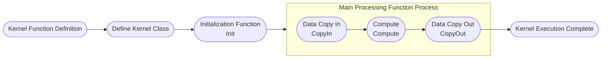

# AI Core Operator Development Guide

## Overview

> **Note:**
>
> 1. For basic concepts involved in operator development such as Tiling, Kernel, and hardware architecture, please refer to [Ascend C Operator Development](https://hiascend.com/document/redirect/CannCommunityOpdevAscendC). For related interfaces, please refer to [Ascend C Operator Development Interface](https://hiascend.com/document/redirect/CannCommunityAscendCApi) and [Basic Data Structures and Interfaces](https://hiascend.com/document/redirect/CannCommunitybasicopapi).
> 2. AI Core operators are developed using Ascend C language and run on AI Core hardware units. AI CPU operators are developed using C++ language and run on AI CPU hardware units. If you want to contribute AI CPU operators, please refer to [AI CPU Operator Development Guide](./aicpu_develop_guide.md).
> 3. For operators contributed based on [Ascend/samples](https://gitee.com/ascend/samples/tree/master) repository, please refer to [Appendix > Operator Project Migration](#operator-project-migration) to migrate existing operators to this project.
> 4. build.sh: For commands involved in operator development, use `bash build.sh --help` to view. For function parameter descriptions, refer to [build Parameter Description](../install/build.md).
> 5. For operator migration across platforms (such as migrating operator functionality implemented on Atlas A2 to Ascend 950), please refer to [Cross-Platform Migration Guide](./cross_platform_migration_guide.md).

This development guide uses the `AddExample` operator development as an example to introduce the new operator development process and related deliverables. For complete sample code, please visit the project `examples` directory.

1. [Project Creation](#project-creation): Before developing an operator, complete environment deployment and create an operator directory for subsequent operator compilation and deployment.

2. [Operator Definition](#operator-definition): Operator function description and prototype definition.

3. [Tiling Implementation](#tiling-implementation): Implement Host-side operator Tiling function.

4. [Kernel Implementation](#kernel-implementation): Implement Device-side operator kernel function.

5. [Graph Mode Adaptation](#graph-mode-adaptation): Custom operator implementation running in graph mode.

6. [aclnn Adaptation](#aclnn-adaptation): Custom operators recommend aclnn interface invocation, requiring binary release. For graph mode, please refer to [Appendix](#appendix).

7. [Compilation and Deployment](#compilation-and-deployment): Complete custom operator compilation and installation through project compilation scripts.

8. [Operator Verification](#operator-verification): Verify custom operator functionality through common operator invocation methods.

## Project Creation

**1. Environment Deployment**

Before developing an operator, please refer to [Environment Deployment](../install/quick_install.md) to complete the basic environment setup.

**2. Directory Creation**

Directory creation is an important step in operator development, providing a unified directory structure and file organization for subsequent code writing, compilation, and debugging.

This project's `build.sh` supports quick creation of operator directories. Enter the project root directory and execute the following command:

```bash
# Create specified operator directory, such as bash build.sh --genop=examples/add_example
# ${op_class} represents operator type, such as image class.
# ${op_name} represents the lowercase underscore form of the operator name, such as `AddExample` operator corresponds to add_example. New operators must not have the same name as existing operators.
bash build.sh --genop=${op_class}/${op_name}
```

If the command executes successfully, you will see the following message:

```bash
Create the initial directory for ${op_name} under ${op_class} success
```

After creation, the directory structure is as follows:

```cpp
${op_name}                              # Replace with the lowercase underscore form of the actual operator name
├── examples                            # Operator invocation example
│   └── test_aclnn_${op_name}.cpp       # Operator aclnn invocation example
├── op_host                             # Host-side implementation
│   ├── ${op_name}_def.cpp              # Operator information library, defines basic operator information such as name, input/output, data types
│   ├── ${op_name}_infershape.cpp       # InferShape implementation, implements operator shape derivation, derives output shape at runtime
│   └── ${op_name}_tiling.cpp           # Tiling implementation, divides tensors into multiple small blocks, distinguishes data types for parallel computation
└── op_kernel                           # Device-side Kernel implementation
│   ├── ${op_name}_tiling_key.h         # Tilingkey file, defines the Key of Tiling strategy, identifies different partitioning methods
│   ├── ${op_name}_tiling_data.h        # Tilingdata file, stores configuration data related to Tiling strategy, such as block size, parallelism
│   ├── ${op_name}.cpp                  # Kernel entry file, contains main function and scheduling logic
│   └── ${op_name}.h                    # Kernel implementation file, defines Kernel header file, contains function declarations, structure definitions, logic implementation
└── CMakeLists.txt                      # Operator cmakelist entry
```

If `${op_class}` is a new operator category, you need to add `add_subdirectory(${op_class})` in `CMakeLists.txt`, otherwise it cannot compile normally.

```CMake
if(ENABLE_EXPERIMENTAL)
    # genop adds new experimental operator category
    # add_subdirectory(${op_class})
    add_subdirectory(experimental/image)
else()
    # genop adds new non-experimental operator category
    # add_subdirectory(${op_class})
    add_subdirectory(image)
endif()
```

## Operator Definition

Operator definition requires two deliverables: `README.md` ```${op_name}_def.cpp```

**Deliverable 1: README.md**

Before developing an operator, you need to determine the target operator's functionality and computational logic.

For the custom `AddExample` operator description example, please refer to [AddExample Operator Description](../../../examples/add_example/README.md).

**Deliverable 2: ${op_name}_def.cpp**

Operator information library.

For the custom `AddExample` operator description example, please refer to [AddExample Operator Information Library](../../../examples/add_example/op_host/add_example_def.cpp).

## Tiling Implementation

### Tiling Introduction

Since the AI Core internal storage space in NPU is limited, the entire tensor data cannot be loaded into the computing unit for processing at once. Therefore, the input tensor needs to be divided into multiple small blocks (Tiles) for block-by-block computation. This process is called Tiling.

The algorithm used to guide data partitioning is called Tiling strategy or Tiling algorithm, which determines how to divide input data into multiple computation blocks and guides how the Kernel allocates memory and schedules computation tasks. Tiling and Kernel communicate information through the `TilingData` structure.

### Code Implementation

Tiling requires three deliverables: ```${op_name}_tiling.cpp``` ```${op_name}_tiling_key.h``` ```${op_name}_tiling_data.h```
> Note:
>
> 1. `${op_name}_tiling.cpp` is placed in the `${op_name}/op_host` directory;
> 2. `${op_name}_tiling_key.h` and `${op_name}_tiling_data.h` are placed in the `${op_name}/op_kernel` directory;
> 3. If `${op_name}_tiling.cpp` needs to reference `${op_name}_tiling_data.h`, please use relative path, for example: `#include "../op_kernel/${op_name}_tiling_data.h"`.

**Deliverable 1: ${op_name}_tiling.cpp**

Tiling main partitioning logic.

For detailed implementation, please refer to [add_example_tiling.cpp](../../../examples/add_example/op_host/add_example_tiling.cpp).

> **Empty function implementation in sample:**
>
> 1. **TilingParse**: Graph mode standard deliverable, retains function definition to meet framework invocation specification, can be empty when there is no actual logic.
> 2. **CompileInfo**: Graph mode standard deliverable, retains function definition to meet framework invocation specification, can be empty when there is no actual logic.

```CPP
// ${op_name}_tiling.cpp
// 1.Tiling needs to obtain runtime environment information, including available core count, UB (Unified Buffer) size, and pass the obtained information to CompileInfo. Auto-generated aclnn does not call this function, just return ge::GRAPH_SUCCESS.
static ge::graphStatus TilingParse(gert::TilingParseContext* context)
{
    return ge::GRAPH_SUCCESS;
    // If writing aclnn interface manually, you can complete the parse function according to the following steps
    // // 1.1 Get environment information
    // auto compileInfo = context->GetCompiledInfo<CompileInfo>();
    // OP_CHECK_NULL_WITH_CONTEXT(context, compileInfo);
    // auto platformInfo = context->GetPlatformInfo();
    // auto ascendcPlatform = platform_ascendc::PlatformAscendC(platformInfo);
    // // 1.2 Get available core count
    // compileInfo->totalCoreNum = ascendcPlatform.GetCoreNumAiv();
    // // 1,3 Get UB size
    // uint64_t ubSizePlatForm;
    // ascendcPlatform.GetCoreMemSize(platform_ascendc::CoreMemType::UB, ubSizePlatForm);
    // compileInfo->ubSize = static_cast<int64_t>(ubSizePlatForm);
    // ...
    // return ge::GRAPH_SUCCESS;
}

// 2.Tiling calculation main entry
static ge::graphStatus TilingFunc(gert::TilingContext* context){
    // 2.1 Get platform information
    uint64_t ubSize;
    int64_t coreNum;
    OP_CHECK_IF(
        GetPlatformInfo(context, ubSize, coreNum) != ge::GRAPH_SUCCESS, OP_LOGE(context, "GetPlatformInfo error"),
        return ge::GRAPH_FAILED);
    
    // 2.2 Get input information
    // Get input tensor shape information
    auto inputX = context->GetInputShape(0);
    OP_CHECK_NULL_WITH_CONTEXT(context, inputX);

    // If input shape is scalar, convert to {1}, otherwise keep original shape unchanged
    auto inputShapeX = EnsureNotScalar(inputX->GetStorageShape());

    // Get input tensor description information
    auto inputDesc = context->GetInputDesc(0);
    OP_CHECK_NULL_WITH_CONTEXT(context, inputDesc);

    // Get data type
    dataType = inputDesc->GetDataType();

    // 2.3 Calculate Tiling parameters (design according to different operator functions)
    ...

    // 2.4 Set TilingData information
    ${op_name}TilingData* tiling = context->GetTilingData<${op_name}TilingData>();
    OP_CHECK_NULL_WITH_CONTEXT(context, tiling);
    OP_CHECK_IF(
        memset_s(tiling, sizeof(${op_name}TilingData), 0, sizeof(${op_name}TilingData)) != EOK,
        OP_LOGE(context, "set tiling data error"), return ge::GRAPH_FAILED);
    tiling->totalLength = totalIdx;
    tiling->tileNum = TILE_NUM;

    // 2.5 Set WorkspaceSize (optional)
    size_t* currentWorkspace = context->GetWorkspaceSizes(1);
    OP_CHECK_NULL_WITH_CONTEXT(context, currentWorkspace);
    currentWorkspace[0] = WS_SYS_SIZE;
}

// 3.Tiling registration entry
IMPL_OP_OPTILING(${op_name}).Tiling(TilingFunc).TilingParse<CompileInfo>(TilingParse);
```

**Deliverable 2: ${op_name}_tiling_key.h**

TilingKey is a method within an operator to distinguish different implementations by separating kernel code. The kernel side can select different algorithm logic through TilingKey.

For detailed implementation, please refer to [add_example_tiling_key.h](../../../examples/add_example/op_kernel/add_example_tiling_key.h).

> **Note:** If you need to implement complex parameter combinations for branch selection (involving multiple TilingKey scenarios), please refer to "Utils API > Tiling Template Programming > Template Parameter Meaning" in [Ascend C Operator Development Interface](https://hiascend.com/document/redirect/CannCommunityAscendCApi).

```CPP
// ${op_name}_tiling_key.h
ASCENDC_TPL_ARGS_DECL(
    ${op_name},
    ASCENDC_TPL_UINT_DECL(schMode, 1, ASCENDC_TPL_UI_LIST, ELEMENTWISE_TPL_SCH_MODE_0, ELEMENTWISE_TPL_SCH_MODE_1));

ASCENDC_TPL_SEL(ASCENDC_TPL_ARGS_SEL(
    ASCENDC_TPL_UINT_SEL(schMode, ASCENDC_TPL_UI_LIST, ELEMENTWISE_TPL_SCH_MODE_0, ELEMENTWISE_TPL_SCH_MODE_1)));
```

**Deliverable 3: ${op_name}_tiling_data.h**

Parameters related to partitioning algorithm, such as total data size, data block count per core, stored through structure.

For detailed implementation, please refer to [add_example_tiling_data.h](../../../examples/add_example/op_kernel/add_example_tiling_data.h).

```CPP
// ${op_name}_tiling_data.h
struct ${op_name}TilingData {
    int64_t totalLength;
    int64_t tileNum;
};
```

## Kernel Implementation

### Kernel Introduction

Kernel is the core part of operator execution on NPU, responsible for tensor data loading, computation, and storage, and is the final carrier of operator function implementation. Kernel implementation needs to work closely with Tiling strategy, performing memory allocation and computation scheduling based on `TilingData` and `TilingKey` information provided by Tiling.

Kernel implementation includes the following steps, and the entire process is connected through the `Process` function to achieve a complete operator flow.



### Code Implementation

Kernel requires two deliverables: ```${op_name}.cpp``` ```${op_name}.h```
> Note:
>
> 1. `${op_name}.cpp` as the kernel entry function can only be placed in the `${op_name}/op_kernel` directory;
> 2. `${op_name}.h` file can be placed in corresponding directories according to different SoC or templates, for example: `${op_name}/op_kernel/arch32`, `${op_name}/op_kernel/arch35` or `${op_name}/op_kernel/impl` directories;

**Deliverable 1: ${op_name}.cpp**

Kernel entry file, contains main function and scheduling logic.

For detailed implementation, please refer to [add_example.cpp](../../../examples/add_example/op_kernel/add_example.cpp).

```CPP
// 1. Kernel function definition
// schMode is a template parameter used to support computation paths for different data types (such as float and int32)
// __global__ __aicore__ indicates that this function is a global function that can execute on AI Core
template <uint32_t schMode>
__global__ __aicore__ void add_example(GM_ADDR x, GM_ADDR y, GM_ADDR z, GM_ADDR workspace, GM_ADDR tiling){
    ....
    // Tiling registration entry
    REGISTER_TILING_DEFAULT(AddExampleTilingData);

    // Macro method to get TilingData
    GET_TILING_DATA_WITH_STRUCT(AddExampleTilingData, tilingData, tiling);

    // Instantiate Kernel object based on TilingKey and complete computation
    if constexpr (schMode == static_cast<uint32_t>(AddExampleTilingKey::TILING_KEY_EXAMPLE_FLOAT)) { // float data type takes this branch
        NsAddExample::AddExample<float> op;     // Operator Kernel instance acquisition
        op.Init(x, y, z, &tilingData);          // Operator Kernel instance initialization
        op.Process();                           // Operator Kernel instance execution
    }
    ....
}
```

**Deliverable 2: ${op_name}.h**

Define Kernel header file, contains function declarations, structure definitions, logic implementation, etc.

For detailed implementation, please refer to [add_example.h](../../../examples/add_example/op_kernel/add_example.h).

```C++
// 2. Define Kernel class
template <typename T>
class AddExample
{
public:
    // Default constructor, __aicore__ indicates this function runs on AI Core
    __aicore__ inline AddExample(){};     
    // Initialization function, used to set input/output addresses and Tiling partition information calculation
    __aicore__ inline void Init(GM_ADDR x, GM_ADDR y, GM_ADDR z, const AddExampleTilingData* tilingData);
    // Main processing function, executes data copy and computation
    __aicore__ inline void Process();

private:
    // Function to copy data from GM to LM
    __aicore__ inline void CopyIn(int32_t progress);
    // Function to copy data from LM to GM
    __aicore__ inline void CopyOut(int32_t progress);
    // Function to execute computation, datalength represents current processing data length
    __aicore__ inline void Compute(const int32_t dataLength);

private:
    // Pipe object, used to manage data flow (pipeline for copy and compute)
    TPipe pipe_;
    // Input queue X, copies from GM to LM, BUFFER_NUM represents buffer count, enables double buff for pipeline parallelism, is 2
    TQue<QuePosition::VECIN, BUFFER_NUM> inputQueueX_;
    // Input queue Y, copies from GM to LM, BUFFER_NUM represents buffer count, enables double buff for pipeline parallelism, is 2
    TQue<QuePosition::VECIN, BUFFER_NUM> inputQueueY_;
    // Output queue Z, copies from LM to GM, BUFFER_NUM represents buffer count, enables double buff for pipeline parallelism, is 2
    TQue<QuePosition::VECOUT, BUFFER_NUM> outputQueueZ_;

    // Input X GM address
    GlobalTensor<T> inputGMX_;
    // Input Y GM address
    GlobalTensor<T> inputGMY_;
    // Input Z GM address
    GlobalTensor<T> outputGMZ_;
    
    // Total data length
    int64_t blockLength_ = 0;
    // How many blocks each block is divided into
    int64_t tileNum_ = 0;
    // Data length processed by each tile
    int64_t tileLength_ = 0;
    ...
};

// 3. Initialization function Init
template <typename T>
__aicore__ inline void AddExample<T>::Init(GM_ADDR x, GM_ADDR y, GM_ADDR z, const AddExampleTilingData* tilingData)
{
    // 3.1 Initialize member variables
    blockLength_ = tilingData->totalLength / AscendC::GetBlockNum();
    ...
    // 3.2 Initialize GM addresses
    inputGMX.SetGlobalBuffer((__gm__ T*)x + blockLength_ * AscendC::GetBlockIdx(), blockLength_);
    ...
    // 3.3 Initialize queue lengths
    pipe.InitBuffer(inputQueueX_, BUFFER_NUM, tileLength_ * sizeof(T));
    ...
}

// 4. Main processing function Process
template <typename T>
__aicore__ inline void AddExample<T>::Process()
{
    // Calculate current core processing data loop count
    int32_t loopCount = tileNum_ * BUFFER_NUM;
    for (int32_t i = 0; i < loopCount; i++) {
        CopyIn(i);              // Data copy in
        Compute(i);             // Compute
        CopyOut(i);             // Data copy out
    }
}
...
```

## Graph Mode Adaptation

Graph mode requires three deliverables: ```${op_name}_graph_infer.cpp``` ```${op_name}_infershape.cpp``` ```${op_name}_proto.h```
For detailed description, see Graph Mode Adaptation Guide [graph_develop_guide.md](./graph_develop_guide.md).

## aclnn Adaptation

After operator development and compilation are complete, aclnn interface (a set of C-based APIs) will be automatically generated, which can be directly invoked in applications to call operators.

To implement this invocation method, you need to generate the binary package corresponding to the operator in advance and add a binary compilation json file. Taking `AddExample` operator as an example:

In the `scripts/kernel/binary_config` directory [ascendc_config.json](../../../scripts/kernel/binary_config/ascendc_config.json), register the operator's NPU model and implementation mode. The example is as follows, just enter the actual name and compute_units.

```json
{"name":"AddExample", "compute_units": ["${soc_version}"], "auto_sync":true, "impl_mode" : "high_performance"},
```

## Compilation and Deployment

After operator development is complete, you need to compile the operator project to generate a custom operator installation package \*\.run. The detailed compilation operations are as follows:

1. **Preparation.**

    Refer to [Project Creation](#project-creation) to complete the basic environment setup, and check whether the operator development deliverables are complete and in the corresponding operator category directory.

2. **Configure environment variables.**

    Select the appropriate command according to the actual scenario.

    ```bash
    # Default path installation, taking root user as an example (for non-root users, replace /usr/local with ${HOME})
    source /usr/local/Ascend/cann/set_env.sh
    # Specified path installation
    # source ${install_path}/cann/set_env.sh
    ```

3. **Compile custom operator package.**

   Taking `AddExample` operator as an example, assuming development deliverables are in the `examples` directory, for complete code see [add_example](../../../examples/add_example) directory. If compiling user-defined operators in the `experimental` directory, the compilation command needs to add the compilation parameter `--experimental`.

   > Note: The compilation process depends on third-party open source software. Online scenarios will automatically download. For offline compilation scenarios, you need to install manually. For details, refer to [Offline Compilation](../invocation/quick_op_invocation.md#offline-compilation).

   Enter the project root directory and execute the following compilation command.

   ```bash
   # Compile specified operator, such as bash build.sh --pkg --ops=add_example -j16
   bash build.sh --pkg --soc=${soc_version} --vendor_name=${vendor_name} --ops=${op_list} [-j${n}]

   # Compile specified operators in experimental directory
   bash build.sh --pkg --soc=${soc_version} --vendor_name=${vendor_name} --ops=${op_list} [--experimental] [-j${n}]
   ```

   - --soc: $\{soc\_version\} represents NPU model. Atlas A2 series products use "ascend910b" (default), Atlas A3 series products use "ascend910_93", Ascend 950PR/Ascend 950DT products use "ascend950".
   - --vendor_name (optional): $\{vendor\_name\} represents the constructed custom operator package name, default is custom.
   - --ops (optional): $\{op\_list\} represents operators to be compiled, defaults to compiling all operators when not specified. Format like "--ops=add_example".
   - --experimental (optional): If the compiled operator is a contributed operator, you need to configure --experimental.
   - -j (optional): Specify compilation thread count to speed up compilation.

   If the following message appears, compilation is successful:

   ```bash
    Self-extractable archive "cann-ops-cv-${vendor_name}_linux-${arch}.run" successfully created.
   ```

4. **Install custom operator package.**

    Execute the following command to install:

    ```bash
    # Install run package
    ./build_out/cann-ops-cv-${vendor_name}_linux-${arch}.run
    ```

    The custom operator package is installed in the ```${ASCEND_HOME_PATH}/opp/vendors``` path, where ```${ASCEND_HOME_PATH}``` represents the CANN software installation directory, which can be configured in environment variables in advance.

5. **(Optional) Uninstall custom operator package.**

    After custom operator package installation, `uninstall.sh` will be generated in the ```${ASCEND_HOME_PATH}/opp/vendors/custom_cv/scripts``` directory. You can uninstall the custom operator package through this script with the following command:

    ```bash
    bash ${ASCEND_HOME_PATH}/opp/vendors/custom_cv/scripts/uninstall.sh
    ```

## Operator Verification

During operator development, you can verify through the following methods:

1. [UT Verification](#ut-verification): Verify whether deliverable code can run normally. UT verification does not require NPU environment.

2. [aclnn Invocation Verification](#aclnn-invocation-verification): Verify operator functionality on NPU environment. aclnn invocation verification requires NPU environment.

### UT Verification

UT (Unit Test) is used to verify whether each module of the operator can work normally, including InferShape UT, Tiling UT, Kernel UT, etc.

During the development of main deliverable code, you can quickly verify through UT verification without compiling and deploying operator packages.

UT directory structure is as follows, needs to be created manually by user:

```bash
${op_name}
...                                                     # Other deliverables
└── tests                                               # Test deliverables
    └── ut                                              # UT implementation
        ├── op_host
        │   └── test_${op_name}_tiling.cpp              # Tiling UT implementation
        │   └── test_${op_name}_infershape.cpp          # Infershape UT implementation
        └── op_kernel
            └── test_${op_name}.cpp                     # Kernel UT implementation
```

For commands to execute UT verification, please refer to [Operator Invocation](../invocation/quick_op_invocation.md). The following will introduce the writing of each UT deliverable in turn.

#### InferShape UT

InferShape UT is used to verify whether the Host-side InferShape logic is correct. After given the operator input, whether InferShape can execute correctly and whether the output meets expectations. It is recommended to complete this during the operator development phase.

UT writing guide is as follows. For detailed implementation, please refer to the sample UT implementation [test_add_example_infershape.cpp](../../../examples/add_example/tests/ut/op_host/test_add_example_infershape.cpp).

**1. Organization Structure and Naming Suggestions**

- **Header files**: Uniformly include `iostream`, `gtest/gtest.h`, `infershape_context_faker.h`, `infershape_case_executor.h`.
- **Test class**: Inherit `testing::Test`, implement `SetUpTestCase/TearDownTestCase` for unified data preparation and cleanup.
- **Naming**: Test class suggests `${OpName}InfershapeTest`, test case suggests `test_case_xxx` for better readability.

Test class example:

```CPP
class ${OpName}InfershapeTest : public testing::Test {
protected:
    static void SetUpTestCase()
    {
        std::cout << "${OpName}InfershapeTest SetUp" << std::endl;
    }
    static void TearDownTestCase()
    {
        std::cout << "${OpName}InfershapeTest TearDown" << std::endl;
    }
};
```

**2. Test Case Basic Flow**

1) Call interface to construct test case context. The main parameters needed are input and output shape/format/dtype.
    - shape/format/dtype can refer to `${op_name}_def.cpp` operator information library
    - If an input is marked as `ValueDepend` in the information library, UT needs to prepare the **actual data value** for that input.
2) Set expected results.
3) Call interface to execute test case.

Simplified example:

```CPP
TEST_F(${OpName}InfershapeTest, test_case_xxx)
{
    // 1. Construct test case context
    gert::InfershapeContextPara infershapeContextPara(
        "${OpName}",
        {
            {{{1, -1, -1, 64}, {1, -1, -1, 64}}, ge::DT_FLOAT16, ge::FORMAT_ND},  // input tensor1
            {{{1, -1, -1, 64}, {1, -1, -1, 64}}, ge::DT_FLOAT16, ge::FORMAT_ND},  // input tensor2
            // If input is ValueDepend, need to additionally pass true and constValue parameters
            // Where constValue is a self-defined variable, such as int constValue[2] = {2, 2}
            // {{{32, 4, 4, 4}, {32, 4, 4, 4}}, ge::DT_FLOAT, ge::FORMAT_ND, true, constValue}
        },
        {
            {{{}, {}}, ge::DT_FLOAT16, ge::FORMAT_ND},  // output tensor
        }
    );
    // 2. Set expected results
    std::vector<std::vector<int64_t>> expectOutputShape = {
        {1, -1, -1, 64},
    };
    // 3. Call interface to execute test case
    ExecuteTestCase(infershapeContextPara, ge::GRAPH_SUCCESS, expectOutputShape);
}
```

#### Tiling UT

Tiling UT is used to verify whether the Host-side Tiling logic is correct. After given the operator input, whether Tiling can execute correctly and whether the output meets expectations. It is recommended to complete this during the operator development phase.

UT writing guide is as follows. For detailed implementation, please refer to the sample UT implementation [test_add_example_tiling.cpp](../../../examples/add_example/tests/ut/op_host/test_add_example_tiling.cpp).

**1. Organization Structure and Naming Suggestions**

- **Header files**: Uniformly include `iostream`, `gtest/gtest.h`, `tiling_context_faker.h`, `tiling_case_executor.h`.
     - If the tiling header file already defines the CompileInfo structure, it also needs to be included.
- **Test class**: Inherit `testing::Test`, implement `SetUpTestCase/TearDownTestCase` for unified data preparation and cleanup.
- **Naming**: Test class suggests `${OpName}TilingTest`, test case suggests `test_case_xxx` for better readability.

Test class example:

```CPP
class ${OpName}TilingTest : public testing::Test {
protected:
    static void SetUpTestCase()
    {
        std::cout << "${OpName}TilingTest SetUp" << std::endl;
    }

    static void TearDownTestCase()
    {
        std::cout << "${OpName}TilingTest TearDown" << std::endl;
    }
};
```

**2. Test Case Basic Flow**

1) Call interface to construct test case context. The main parameters needed are input and output shape/format/dtype, attributes, and compileInfo. You can refer to `${op_name}_def.cpp` operator information library.
    - shape/format/dtype and attributes can refer to `${op_name}_def.cpp` operator information library.
    - If an input is marked as `ValueDepend` in the information library, UT needs to prepare the **actual data value** for that input.
    - compileInfo prioritizes using the structure declared in the tiling header file. If the tiling header file does not declare it, declare it in the test case.
2) Set expected results.
3) Call interface to execute test case.

Simplified example:

```CPP
TEST_F(${OpName}TilingTest, test_case_xxx)
{
    // Declare structure and initialize a structure variable
    struct ${OpName}CompileInfo {
    } compileInfo;
    // 1. Construct test case context
    gert::TilingContextPara tilingContextPara(
        "${OpName}",
        {
            {{{32, 4, 4, 4}, {32, 4, 4, 4}}, ge::DT_FLOAT, ge::FORMAT_ND}, // input tensor1
            {{{32, 4, 4, 4}, {32, 4, 4, 4}}, ge::DT_FLOAT, ge::FORMAT_ND}, // input tensor2
            // If input is ValueDepend, need to additionally pass true and constValue parameters
            // Where constValue is a self-defined variable, such as int constValue[2] = {2, 2}
            // {{{32, 4, 4, 4}, {32, 4, 4, 4}}, ge::DT_FLOAT, ge::FORMAT_ND, true, constValue}
        },
        {
            {{{32, 4, 4, 4}, {32, 4, 4, 4}}, ge::DT_FLOAT, ge::FORMAT_ND}, // output tensor
        },
        {
            // Attributes
            gert::TilingContextPara::OpAttr("${attr_name}", AnyValue::CreateFrom<std::string>("${attr_value}"))
        },
        &compileInfo,
        64,     // Core count obtained in tiling phase
        262144, // UB size obtained in tiling phase, but actual value obtained is 256 bytes less than specified value
        4096    // Specify maximum value of tiling data in tiling phase
    );
    // 2. Set expected results
    uint64_t expectTilingKey = 0;
    string expectTilingData = "2048 32 10912 ";
    std::vector<size_t> expectWorkspaces = {0};
    // 3. Call interface to execute test case
    ExecuteTestCase(tilingContextPara, ge::GRAPH_SUCCESS, expectTilingKey, expectTilingData, expectWorkspaces);
}
```

#### Kernel UT

Kernel UT is used to verify whether the Device-side Kernel logic is correct. After given input/Tiling parameters, whether Kernel can execute correctly and whether the output meets expectations. It is recommended to complete this during the operator development phase.

UT writing guide is as follows. For detailed implementation, please refer to the sample UT implementation [test_add_example.cpp](../../../examples/add_example/tests/ut/op_kernel/test_add_example.cpp).

**1. Organization Structure and Naming Suggestions**

- **Header files**: Suggest uniformly including `gtest/gtest.h`, `tikicpulib.h`, `data_utils.h` and Tiling header file.
    - Directly reference `op_host/${op_name}_tiling.h`
    - Or provide a lightweight adaptation header in UT directory (such as `examples/add_example/tests/ut/op_kernel/add_example_tiling.h`)
    - If Kernel is a template function, you can directly `#include "../../../op_kernel/${op_name}.cpp"` in UT to trigger instantiation (refer to `AddExample`)
- **Test class**: Inherit `testing::Test`, implement `SetUpTestCase/TearDownTestCase` for unified data preparation and cleanup (such as copying data directory, chmod, generating bin).
- **Naming**: Test class suggests `${OpName}KernelTest`, test case suggests `test_case_xxx` for better readability.

Test class example:

```CPP
class ${OpName}KernelTest : public testing::Test {
protected:
    static void SetUpTestCase()
    {
        std::cout << "${OpName}KernelTest SetUp" << std::endl;
        // Prepare test data here uniformly
    }
    static void TearDownTestCase()
    {
        std::cout << "${OpName}KernelTest TearDown" << std::endl;
    }
};
```

**2. Test Case Basic Flow**

1) Set input shape/format/dtype, for initial setup refer to `${op_name}_def.cpp` operator information library.
    - If an input is marked as `ValueDepend` in the information library, UT needs to prepare the **actual data value** for that input.
2) Prepare input/output/Workspace/Tiling buffers (`AscendC::GmAlloc`).
3) Prepare Tiling data (manually construct or generate by Tiling function).
4) Set `ICPU_SET_TILING_KEY` and `AscendC::SetKernelMode`.
5) Use `ICPU_RUN_KF` to execute Kernel.
6) Verify results and release resources (`AscendC::GmFree`).

Simplified example:

```CPP
extern "C" __global__ __aicore__ void ${op_name}(GM_ADDR x, GM_ADDR y, GM_ADDR z,
                                                GM_ADDR workspace, GM_ADDR tiling);

TEST_F(${OpName}KernelTest, test_case_basic)
{
    // 1. Set input shape/format/dtype, prepare ValueDepend input value if necessary
    // 2. Allocate input/output/workspace/tiling memory
    uint8_t* x = (uint8_t*)AscendC::GmAlloc(...);
    uint8_t* y = (uint8_t*)AscendC::GmAlloc(...);
    uint8_t* z = (uint8_t*)AscendC::GmAlloc(...);
    uint8_t* workspace = (uint8_t*)AscendC::GmAlloc(...);
    uint8_t* tiling = (uint8_t*)AscendC::GmAlloc(sizeof(${op_name}TilingData));

    // 3. Prepare tiling data (manually construct or generate by tiling function)
    auto* tilingData = reinterpret_cast<${op_name}TilingData*>(tiling);
    tilingData->... = ...;

    // 4. Set tiling key and execute kernel
    ICPU_SET_TILING_KEY(tilingKey);
    AscendC::SetKernelMode(KernelMode::AIV_MODE);
    ICPU_RUN_KF(${op_name}, blockDim, x, y, z, workspace, tiling);

    // 5. Verify results
    EXPECT_EQ(..., ...);

    // 6. Release resources
    AscendC::GmFree(x);
    AscendC::GmFree(y);
    AscendC::GmFree(z);
    AscendC::GmFree(workspace);
    AscendC::GmFree(tiling);
}
```

**3. Tiling Data Preparation Methods**

- **Manual construction**: Suitable for few fields and simple logic.

- **Call Tiling function to automatically generate**: Suitable for many fields and complex dependency on attributes/shape. Can reuse `tests/ut/common/tiling_context_faker.h` and `tiling_case_executor.h`. Example:

```CPP
gert::TilingContextPara para("OpName",
    {{{{2, 2, 2, 1}, {2, 2, 2, 1}}, ge::DT_FLOAT, ge::FORMAT_ND}},
    {{{{2, 1, 2, 2}, {2, 1, 2, 2}}, ge::DT_FLOAT, ge::FORMAT_ND}},
    {gert::TilingContextPara::OpAttr("attr", AnyValue::CreateFrom<int64_t>(1))},
    &compileInfo);

TilingInfo tilingInfo;
ASSERT_TRUE(ExecuteTiling(para, tilingInfo));
uint8_t* tiling = (uint8_t*)AscendC::GmAlloc(tilingInfo.tilingDataSize);
std::memcpy(tiling, tilingInfo.tilingData.get(), tilingInfo.tilingDataSize);
ICPU_SET_TILING_KEY(tilingInfo.tilingKey);
uint32_t blockDim = tilingInfo.blockNum;
```

**4. Data Generation and Result Comparison**

- Can use `ReadFile/WriteFile` in `tests/ut/op_kernel/data_utils.h` to read/write binary.
- Combine `gen_data.py`/`compare_data.py` scripts to generate and compare data. Refer to `add_example`'s `add_example_data` directory:
  [gen_data.py](../../../examples/add_example/tests/ut/op_kernel/add_example_data/gen_data.py),
  [compare_data.py](../../../examples/add_example/tests/ut/op_kernel/add_example_data/compare_data.py).
- Simple operators can directly calculate expected values in UT and compare.
    - Floating-point comparison suggests using `EXPECT_NEAR/ASSERT_NEAR` and setting reasonable tolerance.

### aclnn Invocation Verification

```bash
# Before execution, need to import environment variables
export LD_LIBRARY_PATH=${ASCEND_HOME_PATH}/opp/vendors/${vendor_name}_cv/op_api/lib:${LD_LIBRARY_PATH}
```

After the developed operator completes compilation and deployment, you can verify functionality through aclnn method. Please refer to [Operator Invocation Method](../invocation/op_invocation.md).

## Appendix

If custom operators need to run in graph mode, aclnn adaptation is not required. For detailed content, please refer to [Graph Mode Development Guide](./graph_develop_guide.md).

### Operator Project Migration

Since there are differences between Ascend/samples project and this project, after creating a project in this project (refer to [Project Creation](#project-creation)), please refer to the migration methods in the table below for migration.

<table border="1">
  <tr>
    <th>cann-ops</th>
    <th>gitcode</th>
    <th>Migration Method</th>
    <th>Code Example</th>
  </tr>
  <tr>
    <td rowspan="4">op_host/{op_name}.cpp</td>
    <td>op_host/{op_name}_def.cpp</td>
    <td>Separate the operator prototype description part from the original op_host/{op_name}.cpp</td>
    <td><a href="#op_hostop_name_defcpp">op_host/{op_name}_def.cpp</a>
    </td>
  </tr>
  <tr>
    <td>op_host/{op_name}_infershape.cpp</td>
    <td>(Optional) Separate the shape derivation part from the original op_host/{op_name}.cpp</td>
    <td><a href="#op_hostop_name_infershapecpp">op_host/{op_name}_infershape.cpp</a>
    </td>
  </tr>
  <tr>
    <td>op_host/{op_name}_tiling.cpp</td>
    <td>Only keep TilingFunc from the original op_host/{op_name}.cpp</td>
    <td><a href="#op_hostop_name_tilingcpp">op_host/{op_name}_tiling.cpp</a></td>
  </tr>
  <tr>
    <td>op_graph/{op_name}_graph_infer.cpp</td>
    <td>(Optional) Separate the type derivation part from the original op_host/{op_name}.cpp</td>
    <td><a href="#op_graphop_name_graph_infercpp">op_graph/{op_name}_graph_infer.cpp</a></td>
  </tr>
  <tr>
    <td>op_host/{op_name}_tiling.h</td>
    <td>op_kernel/{op_name}_tiling_data.h</td>
    <td>Change the macro-defined Tiling structure definition in the original op_host directory to C++ standard definition</td>
    <td><a href="#op_kernelop_name_tiling_datah">op_kernel/{op_name}_tiling_data.h</a></td>
  </tr>
  <tr>
    <td rowspan="2">op_kernel/{op_name}.cpp</td>
    <td>op_kernel/{op_name}.h</td>
    <td>Keep the operator class definition part of kernel implementation from the original op_host/{op_name}.cpp</td>
    <td><a href="#op_kernelop_nameh">op_kernel/{op_name}.h</a></td>
  </tr>
  <tr>
    <td>op_kernel/{op_name}.cpp</td>
    <td>Migrate the kernel function implementation from the original op_host/{op_name}.cpp to cpp file, and:
      <br>. Add REGISTER_TILING_DEFAULT call to register Tiling structure, use GET_TILING_DATA_WITH_STRUCT to get TilingData
      <br>. Add tiling template, support template parameter passing, select different kernel-side implementation based on template parameter branch judgment
    </td>
    <td><a href="#op_kernelop_namecpp">op_kernel/{op_name}.cpp</a></td>
  </tr>
  <tr>
    <td>op_kernel/tiling_key_{op_name}.h</td>
    <td>op_kernel/{op_name}_tiling_key.h</td>
    <td>Keep the operator template parameter definition from the original op_kernel/tiling_key_{op_name}.h. If op_kernel/tiling_key_{op_name}.h does not exist, add template parameter and template parameter combination definition</td>
    <td><a href="#op_kernelop_name_tiling_keyh">op_kernel/{op_name}_tiling_key.h</a></td>
  </tr>
</table>

<div id="op_hostop_name_defcpp">
<p style="font-size:18px;"><b>op_host/{op_name}_def.cpp</b></p>
</div>

Separate the operator information library content from the original ${op_name}.cpp to this file, need to remove SetInferShape and SetTiling content.

```CPP
// Operator information library content in original ${op_name}.cpp
namespace ops {
class AddCustom : public OpDef {
public:
    explicit AddCustom(const char *name) : OpDef(name)
    {
        this->Input("x")
        ....
        this->Output("z")
            .ParamType(REQUIRED)
            .DataType({ge::DT_FLOAT16, ge::DT_FLOAT})
            .Format({ge::FORMAT_ND, ge::FORMAT_ND});

        this->SetInferShape(ge::InferShape).SetInferDataType(ge::InferDataType);   // Need to remove SetInferShape
        this->AICore()
            .SetTiling(optiling::TilingFunc)                                       // Need to remove SetTiling
            .AddConfig("ascend910")
            .AddConfig("ascend310p")
            .AddConfig("ascend310b")
            .AddConfig("ascend910b");
    }
};
OP_ADD(AddCustom);
} // namespace ops

// After migrating to op_host/{op_name}_def.cpp, there is no SetInferShape and SetTiling content in the code
namespace ops {
class AddCustom : public OpDef {
public:
    explicit AddCustom(const char *name) : OpDef(name)
    {
        this->Input("x")
        ....
        this->Output("z")
            .ParamType(REQUIRED)
            .DataType({ge::DT_FLOAT16, ge::DT_FLOAT})
            .Format({ge::FORMAT_ND, ge::FORMAT_ND});

        this->AICore()
            .AddConfig("ascend910")
            .AddConfig("ascend310p")
            .AddConfig("ascend310b")
            .AddConfig("ascend910b");
    }
};
OP_ADD(AddCustom);
} // namespace ops
```

<div id="op_hostop_name_infershapecpp">
<p style="font-size:18px;"><b>op_host/{op_name}_infershape.cpp</b></p>
</div>

Graph mode scenario needs to adapt this file. Separate the shape derivation part from the original ${op_name}.cpp to this file, and call interface IMPL_OP_INFERSHAPE to complete InferShape registration.

```CPP
// InferShape in original ${op_name}.cpp
namespace ge {
static graphStatus InferShape(gert::InferShapeContext *context)
{
    const gert::Shape *x1_shape = context->GetInputShape(0);
    gert::Shape *y_shape = context->GetOutputShape(0);
    *y_shape = *x1_shape;
    return GRAPH_SUCCESS;
}
} // namespace ge

// After migrating to op_host/{op_name}_infershape.cpp, call interface IMPL_OP_INFERSHAPE to complete InferShape registration
namespace ge {
static graphStatus InferShape(gert::InferShapeContext *context)
{
    const gert::Shape *x1_shape = context->GetInputShape(0);
    gert::Shape *y_shape = context->GetOutputShape(0);
    *y_shape = *x1_shape;
    return GRAPH_SUCCESS;
}
IMPL_OP_INFERSHAPE(AddCustom).InferShape(InferShape);   // Complete InferShape registration in this file
} // namespace ge
```

<div id="op_hostop_name_tilingcpp">
<p style="font-size:18px;"><b>op_host/{op_name}_tiling.cpp</b></p>
</div>

After migrating TilingFunc from the original ${op_name}.cpp to this file, call interface IMPL_OP_OPTILING to complete TilingFunc registration.
After changing macro-defined TilingData structure to standard C++ structure, TilingFunc no longer uses tiling.set_xxx for assignment in structure member variables, but directly assigns values to member variables.
If adding template parameter and template parameter combination definition, TilingFunc also needs to configure template parameter tilingKey.
Please refer to [add_example_tiling.cpp](../../../examples/add_example/op_host/add_example_tiling.cpp).

```CPP
// TilingFunc in original ${op_name}.cpp
namespace optiling {
const uint32_t BLOCK_DIM = 8;
const uint32_t DEFAULT_TILE_NUM = 8;
constexpr int MIN_LENGTH_FOR_SPLIT = 2048;
static ge::graphStatus TilingFunc(gert::TilingContext *context)
{
    TilingData tiling;
    uint32_t totalLength = context->GetInputShape(0)->GetOriginShape().GetShapeSize();
    ge::DataType dtype_x = context->GetInputDesc(0)->GetDataType();
    ge::DataType dtype_y = context->GetInputDesc(1)->GetDataType();
    ge::DataType dtype_z = context->GetOutputDesc(0)->GetDataType();
    ....
    tiling.set_totalLength(totalLength);
    tiling.SaveToBuffer(context->GetRawTilingData()->GetData(), context->GetRawTilingData()->GetCapacity());
    context->GetRawTilingData()->SetDataSize(tiling.GetDataSize());
    const uint64_t tilingKey = GET_TPL_TILING_KEY(D_T_X, D_T_Y, D_T_Z, TILE_NUM, IS_SPLIT); // Template parameter tilingkey configuration
    context->SetTilingKey(tilingKey);
    size_t *currentWorkspace = context->GetWorkspaceSizes(1);
    currentWorkspace[0] = 0;
    return ge::GRAPH_SUCCESS;
}
} // namespace optiling

// After migrating to op_host/{op_name}_tiling.cpp, call interface IMPL_OP_OPTILING to complete TilingFunc registration, directly assign values to structure member variables,
namespace optiling {
const uint32_t BLOCK_DIM = 8;
const uint32_t DEFAULT_TILE_NUM = 8;
constexpr int MIN_LENGTH_FOR_SPLIT = 2048;
static ge::graphStatus TilingFunc(gert::TilingContext *context)
{
    // TilingData tiling;
    TilingData* tiling = context->GetTilingData<TilingData>();
    uint32_t totalLength = context->GetInputShape(0)->GetOriginShape().GetShapeSize();
    ge::DataType dtype_x = context->GetInputDesc(0)->GetDataType();
    ge::DataType dtype_y = context->GetInputDesc(1)->GetDataType();
    ge::DataType dtype_z = context->GetOutputDesc(0)->GetDataType();
    ....
    tiling->totalLength = totalLength;   // Directly assign values to structure member variables
    // tiling.set_totalLength(totalLength);   // No longer use tiling.set_xxx for assignment
    // tiling.SaveToBuffer(context->GetRawTilingData()->GetData(), context->GetRawTilingData()->GetCapacity());
    // context->GetRawTilingData()->SetDataSize(tiling.GetDataSize());
    const uint64_t tilingKey = GET_TPL_TILING_KEY(D_T_X, D_T_Y, D_T_Z, TILE_NUM, IS_SPLIT); // Template parameter tilingkey configuration
    context->SetTilingKey(tilingKey);
    size_t *currentWorkspace = context->GetWorkspaceSizes(1);
    currentWorkspace[0] = 0;
    return ge::GRAPH_SUCCESS;
}
IMPL_OP_OPTILING(AddCustom).Tiling(TilingFunc);   // Complete TilingFunc registration in this file
} // namespace optiling
```

<div id="op_graphop_name_graph_infercpp">
<p style="font-size:18px;"><b>op_graph/{op_name}_graph_infer.cpp</b></p>
</div>
Graph mode scenario needs to adapt this file. After separating the type derivation from the original ${op_name}.cpp to this file, call interface IMPL_OP to complete InferDataType registration.

```CPP
// InferDataType in original ${op_name}.cpp
namespace ge {
static graphStatus InferDataType(gert::InferDataTypeContext *context)
{
    const auto inputDataType = context->GetInputDataType(0);
    context->SetOutputDataType(0, inputDataType);
    return ge::GRAPH_SUCCESS;
}
} // namespace ge

// After migrating to op_graph/{op_name}_graph_infer.cpp, call interface IMPL_OP to complete InferDataType registration
namespace ge {
static graphStatus InferDataType(gert::InferDataTypeContext *context)
{
    const auto inputDataType = context->GetInputDataType(0);
    context->SetOutputDataType(0, inputDataType);
    return ge::GRAPH_SUCCESS;
}
IMPL_OP(AddCustom).InferDataType(InferDataType);   // Complete InferDataType function registration in this file
} // namespace ge
```

<div id="op_kernelop_name_tiling_datah">
<p style="font-size:18px;"><b>op_kernel/{op_name}_tiling_data.h</b></p>
</div>

```CPP
// Macro-defined TilingData structure in original op_host/{op_name}_tiling.h
namespace optiling {
BEGIN_TILING_DATA_DEF(TilingData)
TILING_DATA_FIELD_DEF(uint32_t, totalLength);
END_TILING_DATA_DEF;

REGISTER_TILING_DATA_CLASS(XXX, TilingData)
} // namespace optiling

// After migrating to op_kernel/{op_name}_tiling_data.h, change to C++ standard structure
struct TilingData {
    uint32_t  totalLength;
};
```

<div id="op_kernelop_nameh">
<p style="font-size:18px;"><b>op_kernel/{op_name}.h</b></p>
</div>

Keep the operator class definition part of kernel implementation from the original op_host/{op_name}.cpp.

<div id="op_kernelop_namecpp">
<p style="font-size:18px;"><b>op_kernel/{op_name}.cpp</b></p>
</div>

```CPP
// Kernel function implementation in original op_kernel/{op_name}.cpp
template<int D_T_X, int D_T_Y, int D_T_Z, int TILE_NUM, int IS_SPLIT>
 __global__ __aicore__ void add_custom(GM_ADDR x, GM_ADDR y, GM_ADDR z, GM_ADDR workspace, GM_ADDR tiling)
{
    GET_TILING_DATA(tiling_data, tiling);
    if(D_T_X == ADD_TPL_FP32 && D_T_Y == ADD_TPL_FP32 && D_T_Z == ADD_TPL_FP32){
        KernelAdd<float, float, float> op;
        op.Init(x, y, z, tiling_data.totalLength, TILE_NUM);
        op.Process1();
    }else if(D_T_X == ADD_TPL_FP16 && D_T_Y == ADD_TPL_FP16 && D_T_Z == ADD_TPL_FP16){
        KernelAdd<half, half, half> op;
        if(IS_SPLIT == 0){
            op.Init(x, y, z, tiling_data.totalLength, TILE_NUM);
            op.Process1();
        }else if(IS_SPLIT == 1){
            op.Init(x, y, z, tiling_data.totalLength, TILE_NUM);
            op.Process2();
        }
    }
}

// After migrating to op_kernel/{op_name}.cpp, add REGISTER_TILING_DEFAULT call to register Tiling structure, use GET_TILING_DATA_WITH_STRUCT to get TilingData
template<int D_T_X, int D_T_Y, int D_T_Z, int TILE_NUM, int IS_SPLIT>
 __global__ __aicore__ void add_custom(GM_ADDR x, GM_ADDR y, GM_ADDR z, GM_ADDR workspace, GM_ADDR tiling)
{
    // GET_TILING_DATA(tiling_data, tiling);
    REGISTER_TILING_DEFAULT(TilingData);   // Add REGISTER_TILING_DEFAULT call to register TilingData structure
    GET_TILING_DATA_WITH_STRUCT(TilingData, tiling_data, tiling);   // Macro GET_TILING_DATA_WITH_STRUCT gets TilingData
    if(D_T_X == ADD_TPL_FP32 && D_T_Y == ADD_TPL_FP32 && D_T_Z == ADD_TPL_FP32){
        KernelAdd<float, float, float> op;
        op.Init(x, y, z, tiling_data.totalLength, TILE_NUM);
        op.Process1();
    }else if(D_T_X == ADD_TPL_FP16 && D_T_Y == ADD_TPL_FP16 && D_T_Z == ADD_TPL_FP16){
        KernelAdd<half, half, half> op;
        if(IS_SPLIT == 0){
            op.Init(x, y, z, tiling_data.totalLength, TILE_NUM);
            op.Process1();
        }else if(IS_SPLIT == 1){
            op.Init(x, y, z, tiling_data.totalLength, TILE_NUM);
            op.Process2();
        }
    }
}
```

<div id="op_kernelop_name_tiling_keyh">
<p style="font-size:18px;"><b>op_kernel/{op_name}_tiling_key.h</b></p>
</div>

Keep the operator template parameter definition from the original op_kernel/tiling_key_{op_name}.h. If op_kernel/tiling_key_{op_name}.h does not exist, please refer to [add_example_tiling_key.h](../../../examples/add_example/op_kernel/add_example_tiling_key.h) to add template parameter and template parameter combination definition.
