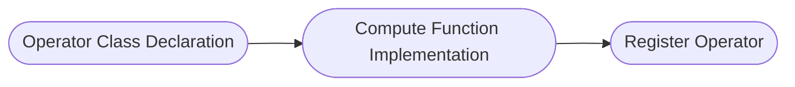

# AI CPU Operator Development Guide

## Overview

> Note:
>
> 1. For basic concepts and AI CPU interfaces involved in operator development, please refer to [TBE&AI CPU Operator Development](https://hiascend.com/document/redirect/CannCommunityOpdevWizard) for detailed introduction.
> 2. AI CPU operators are developed using C++ language and run on AI CPU hardware units.
> 3. build.sh: For commands involved in operator development, use `bash build.sh --help` to view. For function parameter descriptions, refer to [build Parameter Description](../install/build.md).

This development guide uses the `AddExample` operator development as an example to introduce the new operator development process and related deliverables. For complete sample code, please visit the project `examples` directory.

1. [Project Creation](#project-creation): Before developing an operator, complete environment deployment and create an operator directory for subsequent operator compilation and deployment.

2. [Operator Definition](#operator-definition): Determine operator functionality and prototype definition.

3. [Kernel Implementation](#kernel-implementation): Implement Device-side operator kernel function.

4. [aclnn Adaptation](#aclnn-adaptation): Custom operators recommend aclnn interface invocation, requiring binary release in advance. **If using graph mode to invoke operators**, please refer to [Graph Mode Adaptation Guide](./graph_develop_guide.md).

5. [Compilation and Deployment](#compilation-and-deployment): Complete custom operator compilation and installation through project compilation scripts.

6. [Operator Verification](#operator-verification): Verify custom operator functionality through common operator invocation methods.

## Project Creation

**1. Environment Deployment**

Before developing an operator, please refer to [Environment Deployment](../install/quick_install.md) to complete the basic environment setup.

**2. Directory Creation**

Directory creation is an important step in operator development, providing a unified directory structure and file organization for subsequent code writing, compilation, and debugging.

You can quickly create operator directories through `build.sh`. Enter the project root directory and execute the following command:

```bash
# Create specified operator directory, such as bash build.sh --genop_aicpu=examples/add_example
# ${op_class} represents operator type, such as image class.
# ${op_name} represents the lowercase underscore form of the operator name, such as `AddExample` operator corresponds to add_example. New operators must not have the same name as existing operators.
bash build.sh --genop_aicpu=${op_class}/${op_name}
```

If the command executes successfully, you will see the following message:

```bash
Create the AI CPU initial directory for ${op_name} under ${op_class} success
```

After creation, the directory structure is as follows:

```cpp
${op_name}                              # Replace with the lowercase underscore form of the actual operator name
├── examples                            # Operator invocation example
│   └── test_aclnn_${op_name}.cpp       # Operator aclnn invocation example
├── op_host                             # Host-side implementation
│   └── ${op_name}_infershape.cpp       # InferShape implementation, implements operator shape derivation, derives output shape at runtime
├── op_kernel_aicpu                     # Device-side Kernel implementation
│   ├── ${op_name}_aicpu.cpp            # Kernel entry file, contains main function and scheduling logic
│   ├── ${op_name}_aicpu.h              # Kernel header file, contains function declarations, structure definitions, logic implementation
│   └── ${op_name}.json                 # Operator information library, defines basic operator information such as name, input/output, data types
├── tests                               # UT implementation
│   └── ut                              # kernel/aclnn UT implementation
└── CMakeLists.txt                      # Operator cmakelist entry
```

If ```${op_class}``` is a new operator category, you need to add `add_subdirectory(${op_class})` in `CMakeLists`, otherwise it cannot compile normally.

```CMake
if(ENABLE_EXPERIMENTAL)
  # genop adds new experimental operator category
  # add_subdirectory(${op_class})
  add_subdirectory(experimental/image)
else()
  # genop adds new non-experimental operator category
  # add_subdirectory(${op_class})
  add_subdirectory(image)
endif()
```

## Operator Definition

Operator definition requires two deliverables: `README.md` ```${op_name}.json```

**Deliverable 1: README.md**

Before developing an operator, you need to determine the target operator's functionality and computational logic.

For the custom `AddExample` operator description example, please refer to [AddExample Operator Description](../../../examples/add_example_aicpu/README.md).

**Deliverable 2: ${op_name}.json**

Operator information library.

For the custom `AddExample` operator description example, please refer to [AddExample Operator Information Library](../../../examples/add_example_aicpu/op_kernel_aicpu/add_example.json).

## Kernel Implementation

### Kernel Introduction

Kernel is the core part of operator execution on NPU. Kernel implementation includes the following steps:



### Code Implementation

Kernel requires two deliverables: ```${op_name}_aicpu.cpp``` ```${op_name}_aicpu.h```

**Deliverable 1: ${op_name}_aicpu.h**

Operator class declaration

The first step in Kernel implementation is to declare the operator class in the header file ```op_kernel_aicpu/${op_name}_aicpu.h```. The operator class needs to inherit the CpuKernel base class.
For detailed implementation, please refer to [add_example_aicpu.h](../../../examples/add_example_aicpu/op_kernel_aicpu/add_example_aicpu.h).

```CPP
// 1. Operator class declaration
// Include AI CPU base library header file
#include "cpu_kernel.h"
// Define namespace aicpu (fixed, not allowed to modify), and define operator Compute implementation function
namespace aicpu {
// Operator class inherits CpuKernel base class
class AddExampleCpuKernel : public CpuKernel {
 public:
  ~AddExampleCpuKernel() = default;
  // Declare function Compute (needs to be overridden), parameter CpuKernelContext is the context of CPUKernel, including operator input, output and attribute information
  uint32_t Compute(CpuKernelContext &ctx) override;
};
}  // namespace aicpu
```

**Deliverable 2: ${op_name}_aicpu.cpp**

Compute function implementation and AI CPU operator registration

Get input/output Tensor information and perform validity check, then implement core computation logic (such as addition operation), and set computation results to output Tensor.

For detailed implementation, please refer to [add_example_aicpu.cpp](../../../examples/add_example_aicpu/op_kernel_aicpu/add_example_aicpu.cpp).

```C++
// 2. Compute function implementation
#include "add_example_aicpu.h"

namespace {
// Operator name
const char* const kAddExample = "AddExample";
const uint32_t kParamInvalid = 1;
}  // namespace

// Define namespace aicpu
namespace aicpu {
// Implement custom operator class Compute function
uint32_t AddExampleCpuKernel::Compute(CpuKernelContext& ctx) {
  // Get input tensor from CpuKernelContext
  Tensor* input0 = ctx.Input(0);
  Tensor* input1 = ctx.Input(1);
  // Get output tensor from CpuKernelContext
  Tensor* output = ctx.Output(0);

  // Basic validation of tensor, check if it is null pointer
  if (input0 == nullptr || input1 == nullptr || output == nullptr) {
    return kParamInvalid;
  }

  // Get input tensor data type
  auto data_type = static_cast<DataType>(input0->GetDataType());
  // Get input tensor data address, for example input data type is int32
  auto input0_data = reinterpret_cast<int32_t*>(input0->GetData());
  // Get tensor shape
  auto input0_shape = input->GetTensorShape();

  // Get output tensor data address, for example output data type is int32
  auto y = reinterpret_cast<int32_t*>(output->GetData());

  // AddCompute function executes corresponding computation based on input type.
  // Since C++ itself does not support half-precision floating-point type, you can use third-party library Eigen (version 3.3.9 recommended) to represent.
  switch (data_type) {
    case DT_FLOAT:
      return AddCompute<float>(...);
    case DT_INT32:
      return AddCompute<int32>(...);
      ....
    default : return PARAM_INVALID;
  }
}

// 3. Register operator Kernel implementation, used for framework to get operator Kernel Compute function.
REGISTER_CPU_KERNEL(kAddExample, AddExampleCpuKernel);
}  // namespace aicpu
```

## aclnn Adaptation

After operator development and compilation are complete, aclnn interface (a set of C-based APIs) will be automatically generated. No other configuration is needed. You can directly invoke aclnn interface in applications to call operators.

## Compilation and Deployment

After operator development is complete, you need to compile the operator project to generate a custom operator installation package \*\.run. The specific operations are as follows:

1. **Preparation.**

    Refer to [Project Creation](#project-creation) to complete the basic environment setup, and check whether the operator development deliverables are complete and in the corresponding operator category directory.

2. **Compile custom operator package.**

    Taking `AddExample` operator as an example, assuming development deliverables are in the `examples` directory, for complete code see [add_example](../../../examples/add_example_aicpu) directory.

    ```bash
    # Compile specified operator, such as bash build.sh --pkg --ops=add_example
    bash build.sh --pkg --soc=${soc_version} --vendor_name=${vendor_name} --ops=${op_list} [--experimental]
    ```

   - --soc: $\{soc\_version\} represents NPU model. Atlas A2 series products use "ascend910b" (default), Atlas A3 series products use "ascend910_93", Ascend 950PR/Ascend 950DT products use "ascend950".
   - --vendor_name (optional): $\{vendor\_name\} represents the constructed custom operator package name, default is custom.
   - --ops (optional): $\{op\_list\} represents operators to be compiled, defaults to compiling all operators when not specified. Format like "--ops=add_example".
   - --experimental (optional): If the compiled operator is a contributed operator, you need to configure --experimental.
   
    If the following message appears, compilation is successful:
   
    ```bash
    Self-extractable archive "cann-ops-cv-${vendor_name}_linux-${arch}.run" successfully created.
    ```
   
3. **Install custom operator package.**

    ```bash
    # Install run package
    ./build_out/cann-ops-cv-${vendor_name}_linux-${arch}.run
    ```

    The custom operator package is installed in the ```${ASCEND_HOME_PATH}/opp/vendors``` path, where ```${ASCEND_HOME_PATH}``` represents the CANN software installation directory, which can be configured in environment variables in advance.

4. **(Optional) Uninstall custom operator package**

   After custom operator package installation, `uninstall.sh` script will be generated in the ```${ASCEND_HOME_PATH}/opp/vendors/${vendor_name}_cv/scripts``` directory. You can uninstall the custom operator package by executing this script with the following command:

    ```bash
    bash ${ASCEND_HOME_PATH}/opp/vendors/${vendor_name}_cv/scripts/uninstall.sh
    ```

## Operator Verification

Before verifying the operator, ensure that environment variables are configured with the following commands:

```bash
export LD_LIBRARY_PATH=${ASCEND_HOME_PATH}/opp/vendors/${vendor_name}_cv/op_api/lib:${LD_LIBRARY_PATH}
export ASCEND_CUSTOM_OPP_PATH=${ASCEND_HOME_PATH}/opp/vendors/${vendor_name}_cv
```

- **UT Verification**

  During operator development, you can quickly verify through UT verification (such as Kernel).

- **aclnn Invocation Verification**

  After the developed operator completes compilation and deployment, you can verify functionality through aclnn method. Please refer to [Operator Invocation Method](../invocation/op_invocation.md).
  